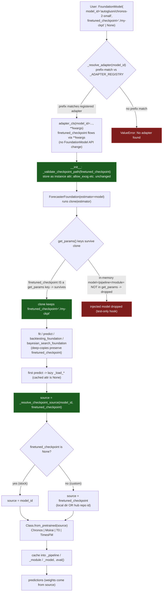

# Plan: Unify custom / fine-tuned checkpoint loading across foundation adapters

## Context

skforecast's `foundation` subsystem wraps zero-shot time-series foundation models
behind a uniform adapter contract (`ChronosAdapter`, `TimesFMAdapter`,
`MoiraiAdapter`, `TabICLAdapter`, `TabPFNAdapter`, `T0Adapter`, `NoriAdapter`,
`TSICLAdapter`, and the planned `TinyTimeMixerAdapter`). Each adapter lazy-loads
its backend weights on the first `predict`.

The `TinyTimeMixerAdapter` plan (`dev/PLAN_TinyTimeMixerAdapter.md`) introduced a
clone-safe `finetuned_checkpoint` string parameter so a user can point an adapter
at a **custom, architecture-compatible** checkpoint (a local directory OR a
HuggingFace hub repo id) instead of the stock checkpoint, without changing the
`FoundationModel` public API. This plan generalizes that same mechanism to the
other adapters that load through a `from_pretrained(model_id)` seam, and
centralizes the shared validation so all adapters stay consistent.

**Scope of this plan: swap the weights SOURCE only.** Loading custom weights this
way assumes the checkpoint is architecture-compatible with the stock model class
the adapter instantiates (same input/output contract: same channels, same head).
It does NOT unlock new capabilities (extra exog channels, a new quantile head);
anything that changes the I/O contract needs per-adapter capability parameters
(as `TinyTimeMixerAdapter` does with `exog_channels` / `quantile_levels`) and is
explicitly out of scope here.

**Precedent: `TinyTimeMixerAdapter`.** That adapter is the reference
implementation. This plan reuses its parameter NAME (`finetuned_checkpoint`) and
its SEMANTICS (local dir or hub repo id; clone-safe; part of `get_params`)
verbatim, so the family stays uniform. `TinyTimeMixerAdapter` itself is a partial
special case (its stock path loads via `get_model`, not `from_pretrained`) and is
refactored only to share the validation helper (File 3).

---

## Why this design (recap of the constraints that force it)

Three facts in the existing code force the shape of the solution; they are the
same constraints documented in the TTM plan and are re-verified here.

1. **Routing is keyed off `model_id`.** `_resolve_adapter` (`_adapters.py:3962`)
   prefix-matches `model_id` against `_ADAPTER_REGISTRY` (`_adapters.py:3949`).
   A bare local path (`./my-model`) or a hub repo under the user's own org
   (`myorg/my-chronos`) will not match any registered prefix and raises
   `No adapter found`. Therefore the routing key and the weights source must be
   **separable**: `model_id` stays the registered-prefix routing key + label,
   `finetuned_checkpoint` carries the real weights source.
2. **`clone()` only preserves `get_params` keys.**
   `ForecasterFoundation.__init__` runs `clone(estimator)`
   (`_forecaster_foundation.py:139`), and `FoundationModel.get_params` returns
   `adapter.get_params()`, which intentionally EXCLUDES the in-memory
   `model`/`pipeline`/`module` test-injection object. So an injected in-memory
   model is dropped the moment the estimator is wrapped in a forecaster (and again
   on every backtest/search deep-copy). A weights reference that must survive
   cloning has to be a plain serializable value: a string path. That is exactly
   what `finetuned_checkpoint` is.
3. **Weights already load through `from_pretrained`.** For the in-scope adapters,
   loading is `X.from_pretrained(self.model_id, ...)`, and HuggingFace
   `from_pretrained` natively accepts a local dir OR a hub repo id. So the swap is
   a one-liner at the load site, not a new code path.

The only alternative that is "cleaner" in the abstract, decoupling adapter
selection from `model_id` via an explicit `adapter=`/`backend=` param, is a larger
public-API change and buys nothing extra for the compatible-weights case. Rejected
for this scope.

---

## Verified adapter audit (source: `skforecast/foundation/_adapters.py`)

Line numbers are as of the current file and may drift; match on the call site, not
the number.

| Adapter | Load call (stock) | Uses `model_id` to load? | Cached attr(s) | `set_params` model-reset trigger set |
|---|---|---|---|---|
| **ChronosAdapter** | `BaseChronosPipeline.from_pretrained(self.model_id, **kwargs)` (`:380`) | Yes | `_pipeline` | `{"model_id", "device_map", "torch_dtype"}` (`:235`) |
| **MoiraiAdapter** | `Moirai2Module.from_pretrained(self.model_id)` (`:1175`) | Yes | `_module`, `_forecast_obj` | `{"model_id", "context_length", "device"}` (`:1035`) |
| **T0Adapter** | `T0Forecaster.from_pretrained(self.model_id)` (`:2759`) | Yes | `_model` | `{"model_id", "device_map", "torch_dtype"}` (`:2597`) |
| **TimesFMAdapter** | `_TimesFMCompat.from_pretrained(self.model_id)` where `_TimesFMCompat(timesfm.TimesFM_2p5_200M_torch)` (`:834`) | Yes, but via a FIXED class | `_model` | `{"model_id", "context_length", "max_horizon", "forecast_config_kwargs"}` (`:664`) |
| TabICLAdapter | `TabICLForecaster(max_context_length=..., ...)` (`:1642`) | **No** (`model_id` never passed) | `_model` | -- |
| TabPFNAdapter | `TabPFNTSPipeline(**kwargs)` (`:2256`) | **No** (`model_id` never passed) | `_model` | -- |
| TSICLAdapter | `TSICL(checkpoint_version=..., allow_auto_download=...)` (`:3214`) | **No** (uses its own `checkpoint_version`) | `_model` | -- |
| NoriAdapter | `NoriRegressor(**self.nori_config)` (`:3728`) | **No** (`model_id` never passed) | `_model` | -- |

### Grouping and decision

- **Group A -- uniform swap applies cleanly:** `ChronosAdapter`, `MoiraiAdapter`,
  `T0Adapter`. Each loads via `<Class>.from_pretrained(self.model_id)`; swap the
  argument to `finetuned_checkpoint or model_id`.
- **Group B -- applies, with a fixed-class caveat:** `TimesFMAdapter`. It loads via
  `from_pretrained` but through a hardcoded class `TimesFM_2p5_200M_torch`
  (wrapped in the local `_TimesFMCompat` shim). The swap works, but the custom
  checkpoint MUST be loadable by that exact class. Document the caveat; do not add
  extra machinery.
- **Group C -- OUT OF SCOPE (no `from_pretrained(model_id)` seam):**
  `TabICLAdapter`, `TabPFNAdapter`, `TSICLAdapter`, `NoriAdapter`. These wrap
  higher-level pipelines/regressors whose constructors manage their own weights
  and do NOT accept `model_id` as a path. Custom weights for these (if the backend
  supports them at all) must flow through the existing per-adapter config dicts
  (`tabicl_config`, `tabpfn_model_config`, `nori_config`) or, for TS-ICL, its
  existing `checkpoint_version` selector. That is a per-backend question, not a
  uniform skforecast seam, so it is deliberately excluded. See "Out-of-scope
  adapters" below for the rationale to record in each docstring.

### Coverage: the mechanism reaches 4 of the 8 existing adapters (why)

This is the single most important finding to internalize before implementing:
**the uniform mechanism cleanly reaches only 4 of the 8 existing adapters**
(Chronos, Moirai, T0, TimesFM). The other 4 (TabICL, TabPFN, TS-ICL, Nori)
genuinely cannot participate without an *upstream backend* change. This is a real,
honest boundary, not an oversight, and the plan documents it rather than pretending
the option is universal.

**The dividing line: HuggingFace primitive vs. wrapper constructor.** The mechanism
works by swapping the argument to a `from_pretrained(...)` call. That seam only
exists when the adapter actually calls `from_pretrained` with `model_id`, because
`from_pretrained` is the HuggingFace primitive that natively accepts *either* a hub
repo id *or* a local directory. Swapping its argument is therefore a one-line
change.

- **The 4 that qualify** end in `<HFClass>.from_pretrained(self.model_id)`:
  - Chronos: `BaseChronosPipeline.from_pretrained(self.model_id, **kwargs)` (`:380`)
  - Moirai: `Moirai2Module.from_pretrained(self.model_id)` (`:1175`)
  - T0: `T0Forecaster.from_pretrained(self.model_id)` (`:2759`)
  - TimesFM: `_TimesFMCompat.from_pretrained(self.model_id)` (`:834`)
- **The 4 that do NOT qualify** call a *higher-level wrapper constructor* that
  manages its own checkpoint internally and never receives `model_id`:
  - TabICL: `TabICLForecaster(max_context_length=..., temporal_features=...,
    point_estimate=..., tabicl_config=...)` (`:1642`) -- `model_id` never passed.
  - TabPFN: `TabPFNTSPipeline(max_context_length=..., tabpfn_mode=...,
    tabpfn_output_selection=..., [tabpfn_model_config=...],
    [temporal_features=...])` (`:2256`) -- `model_id` never passed.
  - TS-ICL: `TSICL(checkpoint_version=..., allow_auto_download=...)` (`:3214`) --
    selects by a *named published revision*, not a path.
  - Nori: `NoriRegressor(**self.nori_config)` (`:3728`) -- `model_id` never passed.

  For these there is literally no `from_pretrained(source)` line to redirect.
  Adding `finetuned_checkpoint` anyway would create a parameter the load path
  ignores -- a silent no-op that looks like it works, which is worse than its
  absence.

**Why this is an UPSTREAM limitation, not a skforecast one.** The constraint lives
in the backend library's API surface, so skforecast cannot fix it locally:

- **TabICL / TabPFN are a different model family.** They are *tabular in-context*
  predictors; the "foundation model" is a tabular regressor, and the time-series
  wrapper (`TabICLForecaster` / `TabPFNTSPipeline`) builds features and calls that
  regressor. A "custom checkpoint" here means a custom *tabular* model, which the
  backend expects via `tabicl_config` / `tabpfn_model_config` *if that release
  exposes such an option* -- there is no TS-level `from_pretrained` to hook.
- **TS-ICL is a partial case.** It *does* have checkpoint selection, but via
  `checkpoint_version` (a published revision name), not an arbitrary local path. A
  user's own fine-tuned local weights are not loadable unless the `TSICL`
  constructor grows a path/repo argument upstream.
- **Nori** builds `NoriRegressor(**nori_config)` with no path/model argument in the
  load path at all.

  For any of these to participate, the **backend library must first add a way to
  point at custom weights** (a `from_pretrained` / `checkpoint_path` / `model=`
  argument on its constructor). The moment it does, that adapter can adopt the
  *exact same four-edit pattern and the shared helpers* with zero new design work.
  That is why this is a clean forward-compatible boundary, not a dead end.

**Two caveats to remember alongside the "4 of 8" count:**

- **TimesFM is the "4th but conditional" one.** It qualifies, but only checkpoints
  loadable by the hardcoded `TimesFM_2p5_200M_torch` class work; a checkpoint for a
  different TimesFM size/architecture will not load. So the honest tally is "3
  unconditional (Chronos, Moirai, T0) + 1 conditional (TimesFM)".
- **Architecture-compatibility applies even to the 4 that qualify.** The seam swaps
  *weights*, never *capabilities*: the custom checkpoint must match the stock
  model's I/O contract (same channels, same head). Adding exog channels or a new
  quantile head is a separate, per-adapter capability job (as in
  `TinyTimeMixerAdapter`) and is out of scope here.

**The honesty payoff.** The rejected alternative -- adding `finetuned_checkpoint`
to all 8 for API symmetry -- would be actively misleading: on 4 adapters it would
be a no-op that looks functional. Instead the plan (1) adds the parameter only
where the seam exists, and (2) records an explicit `Notes` line in each of the
other 4 docstrings telling users how a custom model is (or is not) supported for
that specific backend, pointing them at `tabicl_config` / `tabpfn_model_config` /
`checkpoint_version` / `nori_config` rather than a phantom parameter (see
"Out-of-scope adapters").

---

## Design decisions

- **Parameter name and semantics = identical to `TinyTimeMixerAdapter`.**
  `finetuned_checkpoint: str | None = None`, keyword-only. A local directory path
  OR a HuggingFace hub repo id. `None` (default) => load the stock checkpoint from
  `model_id`, i.e. no behavior change for existing users.
- **`model_id` stays the routing key + label.** With `finetuned_checkpoint` set,
  `model_id` must still start with the adapter's registered prefix (so
  `_resolve_adapter` selects the right adapter) but is never used to download
  anything. Document this in the parameter docstring.
- **Clone-safe by construction.** `finetuned_checkpoint` is added to `get_params`,
  so it survives `clone`, backtesting deep-copies, and search. The in-memory
  `model`/`pipeline`/`module` test-injection stays excluded from `get_params`
  (unchanged) and remains test-only.
- **Reset semantics.** `finetuned_checkpoint` is added to each adapter's existing
  model-reset trigger set in `set_params`, because changing the weights source must
  invalidate the cached model.
- **Shared validation helper.** A single `_validate_checkpoint_path` in `_utils.py`
  enforces "str or None" everywhere, so the message and rules cannot drift between
  adapters. A `_resolve_checkpoint_source` helper centralizes the
  `finetuned_checkpoint or model_id` choice.
- **No `FoundationModel` API change.** `finetuned_checkpoint` flows through
  `FoundationModel.__init__`'s `**kwargs` to the adapter ctor
  (`_foundation_model.py:252`), exactly like every other capability kwarg. Nothing
  in `FoundationModel` changes.
- **Backward compatible.** Default `None` preserves current behavior bit-for-bit;
  `get_params` gains one key per in-scope adapter (additive).

---

## How it works after unification

The diagram traces one `FoundationModel(model_id=..., finetuned_checkpoint=...)`
from construction through the clone that happens inside `ForecasterFoundation`, to
the lazy load where the source is finally chosen. The three highlighted nodes are
the parts this plan adds or relies on; everything else already exists.



Reading the diagram:

- **Routing (`_resolve_adapter`)** still keys off `model_id`, so it must start with
  a registered prefix even for a custom checkpoint; the checkpoint path never
  participates in routing.
- **The clone gate (`get_params`)** is why a string `finetuned_checkpoint` works
  and an in-memory `model=` does not: only `get_params` keys survive
  `clone`/deep-copy, and `finetuned_checkpoint` is one, whereas the injected model
  is deliberately excluded.
- **The source choice (`_resolve_checkpoint_source`)** is the single decision point
  at load time: custom path if set, else `model_id`, then the unchanged
  `from_pretrained(source)` call. This is the only behavioral change on the hot
  path, and it is shared identically by Chronos, Moirai, T0, and TimesFM.

Out-of-scope adapters (TabICL, TabPFN, TS-ICL, Nori) never reach the
`_resolve_checkpoint_source` node: their loaders do not take a `from_pretrained`
source, so the `finetuned_checkpoint` path does not exist for them.

---

## File 1: `skforecast/foundation/_utils.py` -- shared helpers

Add two module-level helpers next to `_validate_positive_int`. House style: double
quotes, <=88 cols, NumPy docstrings, no en/em dashes.

```python
def _validate_checkpoint_path(value: Any) -> str | None:
    """
    Validate a `finetuned_checkpoint` argument.

    Parameters
    ----------
    value : Any
        Candidate checkpoint reference: a local directory path or a
        HuggingFace hub repo id (str), or None.

    Returns
    -------
    value : str or None
        The validated value, unchanged.

    Raises
    ------
    ValueError
        If `value` is neither a string nor None.

    """

    if value is not None and not isinstance(value, str):
        raise ValueError(
            "`finetuned_checkpoint` must be a local directory path or a "
            "HuggingFace hub repo id (str), or None."
        )

    return value


def _resolve_checkpoint_source(model_id: str, finetuned_checkpoint: str | None) -> str:
    """
    Return the weights source for `from_pretrained`.

    When `finetuned_checkpoint` is set it is the source (a local dir or hub
    repo id); otherwise `model_id` is used, preserving stock behavior. In both
    cases `model_id` remains the adapter-routing key and label.

    Parameters
    ----------
    model_id : str
        The registered-prefix model id (routing key + label).
    finetuned_checkpoint : str or None
        A custom checkpoint reference, or None for the stock checkpoint.

    Returns
    -------
    source : str
        The reference passed to `from_pretrained`.

    """

    return finetuned_checkpoint if finetuned_checkpoint is not None else model_id
```

Export nothing new publicly; these are internal (`_`-prefixed), imported by
`_adapters.py` alongside the existing `_validate_positive_int`,
`_apply_set_params`, `_tensor_to_numpy`.

---

## File 2: `skforecast/foundation/_adapters.py` -- per-adapter edits

Each in-scope adapter gets the SAME four mechanical edits. Below are the exact
before/after per adapter. Add the import at the top of `_adapters.py`:

```python
from ._utils import (
    _validate_positive_int,
    _apply_set_params,
    _tensor_to_numpy,
    _validate_checkpoint_path,      # new
    _resolve_checkpoint_source,     # new
)
```
(Adjust to match the file's existing import form.)

For every in-scope adapter also update the class-level and `__init__` docstrings:
add a `finetuned_checkpoint` entry to Parameters and an `Attributes` line, and a
`Notes` sentence: "A custom, architecture-compatible checkpoint can be loaded by
passing `finetuned_checkpoint` (a local dir or hub repo id); `model_id` then only
selects this adapter and labels the model. The checkpoint must match the stock
model architecture (same channels and head); this does not add exogenous or
quantile capabilities."

### 2A. ChronosAdapter

**Edit 1 -- `__init__` signature + body** (`:123`, `:174`):
```python
    def __init__(
        self,
        model_id: str,
        *,
        pipeline: Any | None = None,
        finetuned_checkpoint: str | None = None,     # new
        context_length: int = 8192,
        predict_kwargs: dict[str, Any] | None = None,
        device_map: str = "auto",
        torch_dtype: Any | None = None,
        cross_learning: bool = False,
    ) -> None:
        ...
        _validate_positive_int("context_length", context_length)

        self.model_id             = model_id
        self._pipeline            = pipeline
        self.finetuned_checkpoint = _validate_checkpoint_path(finetuned_checkpoint)  # new
        self.context_             = None
        ...
```

**Edit 2 -- `get_params`** (`:196`): add the key.
```python
        return {
            'model_id':             self.model_id,
            'finetuned_checkpoint': self.finetuned_checkpoint,   # new
            'cross_learning':       self.cross_learning,
            'context_length':       self.context_length,
            'device_map':           self.device_map,
            'torch_dtype':          self.torch_dtype,
            'predict_kwargs':       self.predict_kwargs or None,
        }
```

**Edit 3 -- `set_params`** (`:223`, `:234`): validate + add to reset trigger set.
```python
        def validate(p: dict) -> dict:
            if "context_length" in p:
                _validate_positive_int("context_length", p["context_length"])
            if "predict_kwargs" in p:
                p["predict_kwargs"] = p["predict_kwargs"] or {}
            if "finetuned_checkpoint" in p:                                   # new
                p["finetuned_checkpoint"] = _validate_checkpoint_path(
                    p["finetuned_checkpoint"]
                )
            return p

        return _apply_set_params(
            self, params,
            validate=validate,
            resets=(
                (
                    {"model_id", "finetuned_checkpoint",                      # new
                     "device_map", "torch_dtype"},
                    lambda: setattr(self, "_pipeline", None),
                ),
            ),
        )
```

**Edit 4 -- `_load_pipeline`** (`:380`): swap the source.
```python
        source = _resolve_checkpoint_source(self.model_id, self.finetuned_checkpoint)
        self._pipeline = BaseChronosPipeline.from_pretrained(source, **kwargs)
```

### 2B. MoiraiAdapter

**Edit 1 -- `__init__`** (`:948`, `:982`):
```python
    def __init__(
        self,
        model_id: str,
        *,
        module: Any | None = None,
        finetuned_checkpoint: str | None = None,     # new
        context_length: int = 2048,
        device: str = "auto",
    ) -> None:
        ...
        self.model_id             = model_id
        self._module              = module
        self.finetuned_checkpoint = _validate_checkpoint_path(finetuned_checkpoint)  # new
        self.context_             = None
        ...
```

**Edit 2 -- `get_params`** (`:1000`):
```python
        return {
            'model_id':             self.model_id,
            'finetuned_checkpoint': self.finetuned_checkpoint,   # new
            'context_length':       self.context_length,
            'device':               self.device,
        }
```

**Edit 3 -- `set_params`** (`:1022`, `:1035`): add validate branch, add key to the
`_reset_module` trigger set.
```python
        def validate(p: dict) -> dict:
            if "context_length" in p:
                _validate_positive_int("context_length", p["context_length"])
            if "finetuned_checkpoint" in p:                                   # new
                p["finetuned_checkpoint"] = _validate_checkpoint_path(
                    p["finetuned_checkpoint"]
                )
            return p

        def _reset_module() -> None:
            self._module = None
            self._forecast_obj = None

        return _apply_set_params(
            self, params,
            validate=validate,
            resets=(
                ({"model_id", "finetuned_checkpoint",                         # new
                  "context_length", "device"}, _reset_module),
            ),
        )
```

**Edit 4 -- `_load_module`** (`:1175`):
```python
        source = _resolve_checkpoint_source(self.model_id, self.finetuned_checkpoint)
        self._module = Moirai2Module.from_pretrained(source)
        self._module.eval()
```

### 2C. T0Adapter

**Edit 1 -- `__init__`** (`:2506`, `:2544`):
```python
    def __init__(
        self,
        model_id: str,
        *,
        model: Any | None = None,
        finetuned_checkpoint: str | None = None,     # new
        context_length: int = 8192,
        device_map: str = "auto",
        torch_dtype: Any | None = None,
    ) -> None:
        ...
        self.model_id             = model_id
        self._model               = model
        self.finetuned_checkpoint = _validate_checkpoint_path(finetuned_checkpoint)  # new
        self.context_             = None
        ...
```

**Edit 2 -- `get_params`** (`:2563`):
```python
        return {
            'model_id':             self.model_id,
            'finetuned_checkpoint': self.finetuned_checkpoint,   # new
            'context_length':       self.context_length,
            'device_map':           self.device_map,
            'torch_dtype':          self.torch_dtype,
        }
```

**Edit 3 -- `set_params`** (`:2587`, `:2597`):
```python
        def validate(p: dict) -> dict:
            if "context_length" in p:
                _validate_positive_int("context_length", p["context_length"])
            if "finetuned_checkpoint" in p:                                   # new
                p["finetuned_checkpoint"] = _validate_checkpoint_path(
                    p["finetuned_checkpoint"]
                )
            return p

        return _apply_set_params(
            self, params,
            validate=validate,
            resets=(
                (
                    {"model_id", "finetuned_checkpoint",                      # new
                     "device_map", "torch_dtype"},
                    lambda: setattr(self, "_model", None),
                ),
            ),
        )
```

**Edit 4 -- `_load_model`** (`:2759`): swap the source; keep the gated-repo
`TypeError -> OSError` translation, but report against the actual source.
```python
        source = _resolve_checkpoint_source(self.model_id, self.finetuned_checkpoint)
        try:
            model = T0Forecaster.from_pretrained(source)
        except TypeError as exc:
            raise OSError(
                f"Could not load model '{source}' from the Hugging Face Hub. "
                f"This is often caused by a gated repository whose license has "
                f"not been accepted: visit https://huggingface.co/{source} while "
                f"logged in to accept it, then authenticate locally "
                f"(`hf auth login` or the `HF_TOKEN` environment variable) before "
                f"retrying."
            ) from exc
```
(For a local-directory `source` the hub URL hint is harmless; keep it simple. If
preferred, only include the URL line when `source` is not an existing local path,
but that is optional polish, not required.)

### 2D. TimesFMAdapter (Group B, with caveat)

Same four edits as above, but keep the `_TimesFMCompat` shim.

**Edit 1 -- `__init__`** (`:564`, `:605`): add `finetuned_checkpoint` param after
`model`, store `self.finetuned_checkpoint = _validate_checkpoint_path(...)`.

**Edit 2 -- `get_params`** (`:625`): add `'finetuned_checkpoint':
self.finetuned_checkpoint`.

**Edit 3 -- `set_params`** (`:650`, `:664`): add the validate branch and add
`"finetuned_checkpoint"` to the existing reset trigger set
`{"model_id", "context_length", "max_horizon", "forecast_config_kwargs"}`.

**Edit 4 -- `_load_model`** (`:834`):
```python
        source = _resolve_checkpoint_source(self.model_id, self.finetuned_checkpoint)
        self._model = _TimesFMCompat.from_pretrained(source)
```

**Docstring caveat (TimesFM only):** add to the `finetuned_checkpoint` Parameters
entry: "The checkpoint must be loadable by the `TimesFM_2p5_200M_torch` model
class (the class this adapter instantiates); checkpoints for other TimesFM
architectures are not supported."

---

## File 3: `TinyTimeMixerAdapter` refactor (do AFTER the TTM plan lands)

The TTM adapter already defines `finetuned_checkpoint` and inlines its string
validation (TTM plan `:522-528`, and again in `set_params`, `:664-672`). Refactor
it to call the shared helper so validation cannot drift:

- Replace the inline `isinstance(finetuned_checkpoint, str)` check in `__init__`
  with `self.finetuned_checkpoint = _validate_checkpoint_path(finetuned_checkpoint)`.
- Replace the inline check inside `set_params.validate` with
  `p["finetuned_checkpoint"] = _validate_checkpoint_path(p["finetuned_checkpoint"])`.
- Do NOT collapse TTM's `_load_model` into the single-line `source` swap: TTM's
  stock path uses `get_model(...)` (not `from_pretrained`), so it keeps its
  explicit `if self.finetuned_checkpoint is not None:` branch. TTM may still use
  `_resolve_checkpoint_source` only if it does not disturb the `get_model` path;
  simplest is to leave TTM's branch as-is and share ONLY `_validate_checkpoint_path`.

This step is optional-but-recommended cleanup; it makes TTM consistent with the
family and removes duplicated messages.

---

## Out-of-scope adapters (record the rationale in each docstring)

For `TabICLAdapter`, `TabPFNAdapter`, `TSICLAdapter`, `NoriAdapter`, do NOT add
`finetuned_checkpoint`. Add a one-line `Notes` entry explaining how a custom model
is (or is not) supported, so users are not left guessing:

- **TabICLAdapter / TabPFNAdapter:** "This adapter loads its weights through the
  `TabICLForecaster` / `TabPFNTSPipeline` wrapper, which manages its own
  checkpoint and does not accept a `model_id` path. To use a custom TabICL /
  TabPFN model, pass backend-specific options via `tabicl_config` /
  `tabpfn_model_config` (if the installed backend supports it)."
- **TSICLAdapter:** "TS-ICL selects its checkpoint via the existing
  `checkpoint_version` parameter, not a `from_pretrained` path. Use
  `checkpoint_version` to choose a published revision; a fully custom local
  checkpoint requires backend support in the `TSICL` constructor."
- **NoriAdapter:** "Nori loads through `NoriRegressor(**nori_config)`, which does
  not accept a `model_id` path. Custom-model options, if supported by the backend,
  are passed via `nori_config`."

If a future backend release exposes a `from_pretrained`/path seam for any of
these, it can adopt the exact same four-edit pattern and the shared helpers with
no further design work.

---

## Documentation updates (outside the code)

- `AGENTS.md` / `docs/llms-base.txt` foundation-models section: add a short note
  and one usage snippet showing `finetuned_checkpoint` on a Group-A adapter, and
  list which adapters support it (Chronos, Moirai, T0, TimesFM, TinyTimeMixer).
- The foundation-forecasting user guide / skill (`skills/foundation-forecasting/`):
  add a "Loading a custom or fine-tuned checkpoint" subsection with the caveat that
  the checkpoint must be architecture-compatible and that this does not add exog /
  quantile capabilities.

Usage snippet to include:
```python
from skforecast.foundation import FoundationModel, ForecasterFoundation

model = FoundationModel(
    model_id="autogluon/chronos-2-small",        # routing key + label only
    finetuned_checkpoint="./my-finetuned-chronos" # local dir OR "myorg/my-chronos"
)
forecaster = ForecasterFoundation(estimator=model)
forecaster.fit(series=data["target"])
preds = forecaster.predict(steps=24)   # weights come from finetuned_checkpoint
```

---

## Testing plan

Read `.github/instructions/testing.instructions.md` before writing tests. Add to
each in-scope adapter's test module (e.g.
`skforecast/foundation/tests/test_chronos_adapter.py` or the equivalent existing
file) and mirror across Moirai, T0, TimesFM.

1. **Validation.** `finetuned_checkpoint=123` (non-str, non-None) raises
   `ValueError` with the shared message, in `__init__` and via `set_params`.
2. **`get_params` includes the key.** New adapter =>
   `"finetuned_checkpoint" in adapter.get_params()`, defaults to `None`.
3. **Clone-safety (the key regression guard).**
   `clone(FoundationModel(model_id=..., finetuned_checkpoint="x"))` preserves
   `finetuned_checkpoint="x"` (asserts it survives, unlike an in-memory `model=`).
   This is the behavior the whole design exists to guarantee.
4. **Source selection without a real download.** Monkeypatch the backend
   `from_pretrained` (e.g. `BaseChronosPipeline.from_pretrained`) to a stub that
   records its first positional arg, then trigger `_load_*` and assert the stub was
   called with `finetuned_checkpoint` when set, and with `model_id` when `None`.
   Use the existing test-injection (`pipeline=`/`module=`/`model=`) pattern where a
   full stub model is needed for `predict`.
5. **`set_params` reset.** Setting `finetuned_checkpoint` to a new value clears the
   cached `_pipeline`/`_module`/`_model` (assert it is `None` after `set_params`);
   setting it to the same value does not (mirrors `_apply_set_params` change
   detection).
6. **Backward compatibility.** Existing tests that never pass
   `finetuned_checkpoint` must pass unchanged (default `None` => stock path).
7. **TTM refactor (File 3):** existing TTM validation tests must still pass after
   swapping to `_validate_checkpoint_path`.

Run per module, e.g.:
```bash
pytest skforecast/foundation/tests/ -vv
```
(Confirm the conda environment first per AGENTS.md; per memory this project uses
`skforecast_24_py13`.)

---

## Open checks / risks

- **Backend `from_pretrained` local-path support.** All Group-A/B backends
  (`chronos`, `uni2ts` Moirai2, `t0`, `timesfm`) inherit HuggingFace
  `from_pretrained`, which accepts local dirs and hub repo ids. Re-confirm against
  the pinned versions during implementation that a local directory is accepted
  (some libraries add wrappers). Low risk; this is the standard HF contract.
- **Architecture compatibility is the user's responsibility.** If the checkpoint
  does not match the stock architecture the backend will raise its own load error;
  we surface it as-is (except T0's existing gated-repo translation). Do NOT try to
  pre-validate architecture; keep the adapter thin. State the requirement in the
  docstring.
- **TimesFM fixed class.** Only `TimesFM_2p5_200M_torch` checkpoints load. Caveat
  documented; no code guard.
- **T0 gated-repo message with a local source.** The `TypeError -> OSError`
  translation prints a hub URL; for a local `source` this is slightly off but
  harmless. Optional polish: skip the URL hint when `os.path.isdir(source)`.
- **No `FoundationModel` change needed** -- re-verify `**kwargs` still flows
  (`_foundation_model.py:252`) at implementation time; it does today.

---

## Rollout order

1. Land `dev/PLAN_TinyTimeMixerAdapter.md` (TTM adapter) first -- it is the
   reference implementation and proves the pattern end-to-end.
2. File 1: add `_validate_checkpoint_path` + `_resolve_checkpoint_source` to
   `_utils.py` (with unit tests).
3. File 2: apply the four edits to `ChronosAdapter`, `MoiraiAdapter`, `T0Adapter`,
   `TimesFMAdapter` (one adapter per commit is fine; each is independent).
4. File 3: refactor `TinyTimeMixerAdapter` to use `_validate_checkpoint_path`.
5. Out-of-scope docstrings for TabICL / TabPFN / TSICL / Nori.
6. Documentation updates (`AGENTS.md`, `docs/llms-base.txt`, foundation skill).

Each step is independently shippable and backward compatible.
