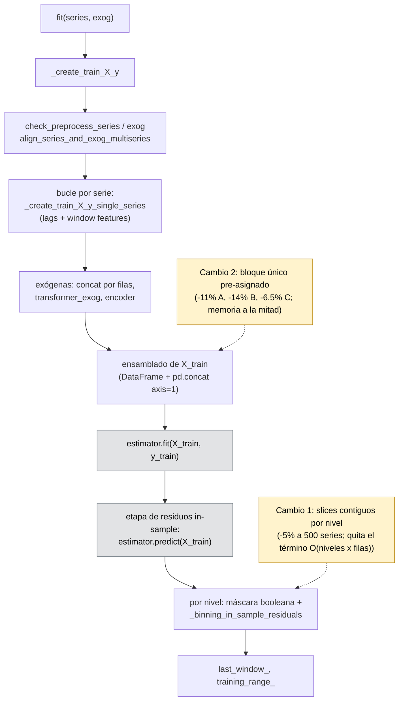
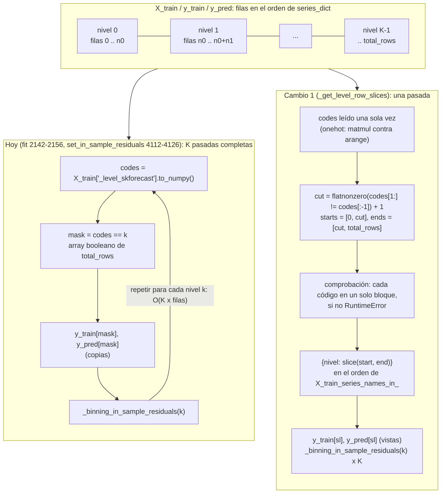
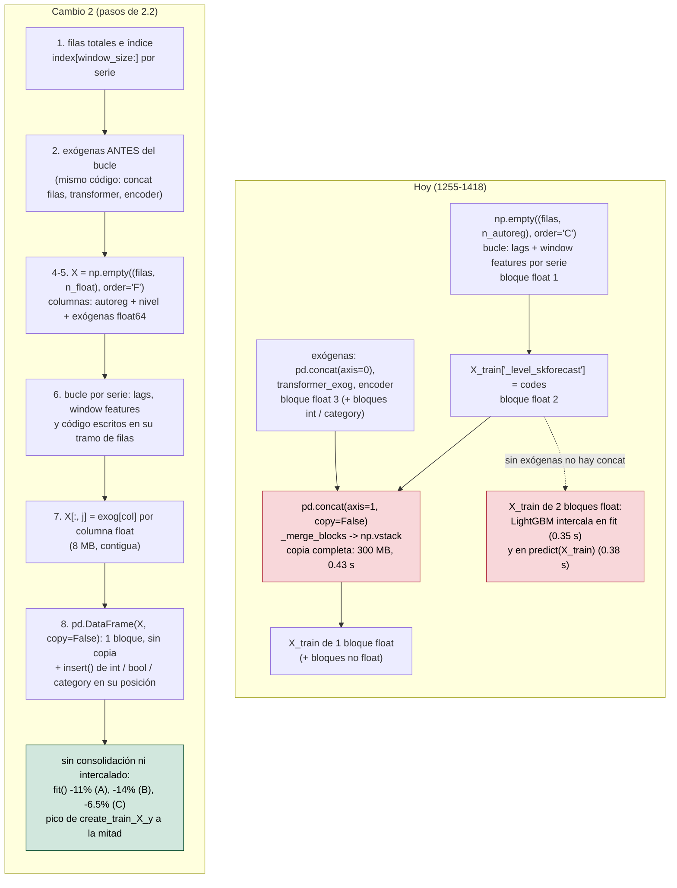
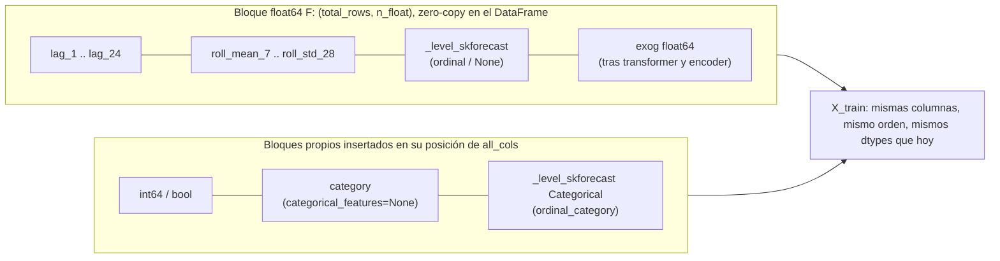

# Plan: optimizaciones del `fit()` de `ForecasterRecursiveMultiSeries` que sí merecen la pena

Fuentes: `dev/profiling_multiseries_fit/REPORT.md` (estudio del 2026-09-15, commit `7d849ed2b`;
las líneas citadas siguen valiendo en `0.25.x` @ `fe51990e4` y en `0.26.x` @ `67bf980ac`
(comprobado el 2026-09-28: `git diff 7d849ed2b 67bf980ac` vacío para los forecasters y
`utils/utils.py`), los archivos perfilados no han cambiado) y el análisis independiente de un compañero (2026-09-16) sobre la creación de las
matrices de entrenamiento, cuyo diseño de bloque único con exógenas se ha verificado en
`dev/profiling_multiseries_fit/proto_xtrain_full_block.py` y sustituye a la versión anterior
de la sección 2. Se implementan los cambios 1 y 2; el cambio 3 (window features por lotes),
que tenía un GO condicionado, se descartó el 2026-10-03 tras medirlo sobre el código real
(sección 3). Los dos son internos, no cambian la API pública, y tienen que dejar `X_train`, `y_train`, las predicciones,
`binner_intervals_` e `in_sample_residuals_` bit a bit idénticos a los actuales. Fuera del
plan: el encoder de categóricas (en el stash "FastOrdinalEncoder categorical exog", SHA
`165f091e`), hacer opcional la etapa de residuos (cambio de API,
`dev/PLAN_optional_residual_stage.md`, release 0.26.0), y todo lo listado en la sección 7
del informe.

### Cómo leer y usar este plan

- **Escenarios A, B, C** (definidos en `dev/profiling_multiseries_fit/common.py`, `make_data`):
  500 series x 2000 observaciones diarias, semilla 123. A: sin exógenas. B: 10 exógenas
  float64 por serie. C: 5 float64 + 5 `category` con cardinalidades 3, 7, 12, 30, 100.
  Forecaster base: `LGBMRegressor(n_estimators=25, random_state=123, verbose=-1, n_jobs=4)`,
  `lags=24`, `RollingFeatures(stats=['mean', 'std'], window_sizes=[7, 28])`,
  `encoding='ordinal'`, `categorical_features='auto'`. `X_train` resultante: ~986 000 filas.
- **Etiquetas de etapa** (`S1.6b`, `S1.r`, `S6a`, `S6.r`, ...): son las del mapa de ejecución
  del informe (`REPORT.md`, sección 3) y del presupuesto por etapa (sección 4). `S1` es
  `_create_train_X_y`, `S4` es `estimator.fit`, `S6` es la etapa de residuos in-sample.
- **Números de línea**: son de `skforecast/recursive/_forecaster_recursive_multiseries.py`
  en `7d849ed2b`. Antes de implementar, comprobar que siguen valiendo con
  `git diff 7d849ed2b HEAD -- skforecast/recursive/_forecaster_recursive_multiseries.py`
  (vacío a fecha 2026-09-16) y, si no, localizar el código por el nombre del método.
  Tras los commits 1 a 3 (2026-10-02) ya no valen: el commit 3 acorta
  `_create_train_X_y_single_series` y reordena `_create_train_X_y`, y el commit 2 añade el
  helper `_get_level_row_slices`. Buscar por nombre de método; las líneas actuales de
  `_create_train_X_y` están en E.3.
- **Entorno de medida**: Windows 11, Intel Core Ultra 9 185H, entorno conda
  `skforecast_24_py13` (Python 3.13.14, numpy 2.4.6, pandas 2.3.3, scikit-learn 1.7.2,
  lightgbm 4.7.0). Los scripts se ejecutan desde la raíz del repositorio con el intérprete
  del entorno y `PYTHONIOENCODING=utf-8`, e importan el working tree (no un skforecast
  instalado; `common.py` lo comprueba):

  ```powershell
  $env:PYTHONIOENCODING = "utf-8"
  C:\Users\Joaquin\miniconda3\envs\skforecast_24_py13\python.exe dev\profiling_multiseries_fit\proto_xtrain_full_block.py --scenarios A B C --reps 5
  C:\Users\Joaquin\miniconda3\envs\skforecast_24_py13\python.exe dev\profiling_multiseries_fit\proto_residual_slices.py
  C:\Users\Joaquin\miniconda3\envs\skforecast_24_py13\python.exe dev\profiling_multiseries_fit\01_stage_budget.py --scenarios A B C --reps 5
  ```

  Cada script escribe su salida en `dev/profiling_multiseries_fit/results/` (`.txt` y `.json`).
  En el repo solo están `common.py`, `proto_residual_slices.py` y `11_snapshot_outputs.py`;
  los demás hay que recuperarlos del stash antes de usarlos (sección E.3).
- **Cómo medir**: los totales de `fit()` varían un 10 a 20% entre procesos en esta máquina
  (turbo, page faults), así que toda comparación debe hacerse dentro del mismo proceso,
  alternando A y B (`common.ab_interleaved`), y precedida de la comprobación de identidad
  (`common.assert_identical_fits`: `X_train`, `y_train`, predicciones con exógenas futuras,
  `X_train_series_names_in_`, `binner_intervals_`, `in_sample_residuals_`,
  `in_sample_residuals_by_bin_`). Los porcentajes de este plan salen de ahí; los tiempos
  absolutos solo sirven como orden de magnitud.
- **Prototipos**: cada cambio tiene una réplica del método afectado en
  `dev/profiling_multiseries_fit/proto_*.py`, comprobada bit a bit contra el método real.
  Son la referencia de implementación (no se copian tal cual: son réplicas parciales que
  lanzan `NotImplementedError` en los caminos que no cubren).

Ganancia medida con 500 series x 2000 observaciones y LightGBM de 25 árboles (`n_jobs=4`),
A/B en el mismo proceso, estado ajustado idéntico:

| Cambio | Sin exógenas (A) | Con exógenas (B, C) | Escala |
|---|---|---|---|
| 1. Slices contiguos por nivel en los residuos | -0.15 s (5%) | -0.17 s (5%) | quita el único término O(niveles x filas): -3 s a 1000 x 4000 (20-25%) |
| 2. `X_train` de un solo bloque (autoreg + nivel + exógenas float) | -0.51 s (11%) | B -0.74 s (14%), C -0.25 s (6.5%) | lineal; pico de memoria de `create_train_X_y` -450 MB con exógenas |

Orden y reparto: una sola rama desde `0.26.x` con cuatro commits, cada uno verde y
bit-idéntico por sí mismo (sección C). El cambio 1 es el más pequeño. El cambio 2 exige
columnas contiguas (orden F) en cualquier caso, así que el cambio 1 no es un requisito previo
suyo.

Dónde actúa cada cambio dentro de `fit()` (los diagramas son Mermaid; se renderizan en
GitHub y en la vista previa de VS Code):



Los nodos grises son LightGBM (u otro estimador): no se tocan. Con 25 árboles son el 45 a
55% del `fit()` a 500 x 2000.

## R. Revalidación en `0.26.x` (2026-09-28)

Stash `3de6e1b6` aplicado sobre `0.26.x` @ `67bf980ac` sin conflictos (solo archivos nuevos
en `dev/`; los archivos de `skforecast/` que toca el plan no han cambiado desde `7d849ed2b`).
Los tres prototipos se re-ejecutaron y siguen siendo bit-idénticos al método real.

Nota (2026-10-03): el cambio 3 (window features por lotes) se descartó después (sección 3).
Las medidas de "los tres cambios" de esta sección lo incluyen: aporta entre 0.1 y 0.2 s de
cada ahorro. Se conservan como referencia histórica.

`12_revalidate_026.py` mide lo que faltaba: los **tres cambios juntos** (réplicas de los tres
prototipos apiladas en un mismo forecaster) frente al `fit()` real, con estimadores más
pesados, en el modo que usan backtesting y búsquedas, y el cambio 2 por `encoding`. A/B en el
mismo proceso, 7 repeticiones (3 con 500 árboles), `assert_identical_fits` en todas
(`results/revalidate_026.{txt,json}`). Ese día las repeticiones de un mismo brazo variaban
de 2.7 a 5.0 s, así que se dan mediana y mínimo; cuando discrepan, el efecto es del orden del
ruido.

| Configuración (500 x 2000) | `fit()` actual (mediana / mín) | ahorro mediana | ahorro mín |
|---|---|---|---|
| A, los tres cambios, LightGBM 25 | 2.86 / 2.67 s | **-27.7%** (0.79 s) | -27.5% |
| B, los tres cambios, LightGBM 25 | 3.43 / 3.19 s | -15.1% (0.52 s) | -20.0% |
| C, los tres cambios, LightGBM 25 | 3.93 / 3.83 s | -16.4% (0.64 s) | -15.8% |
| A, los tres cambios, LightGBM 100 | 8.64 / 5.63 s | -11.3% | -9.0% |
| B, los tres cambios, LightGBM 100 | 7.25 / 6.69 s | -4.8% | -4.5% |
| A, los tres cambios, LightGBM 500 | 16.3 / 15.9 s | -9.4% (1.5 s) | -6.8% |
| B, los tres cambios, LightGBM 500 | 18.5 / 18.4 s | -1.6% (0.3 s) | -1.2% |
| A, `_probabilistic_mode=False`, LightGBM 25 | 3.41 / 3.10 s | -22.2% | -18.3% |
| B, `_probabilistic_mode=False`, LightGBM 25 | 4.27 / 3.96 s | -12.4% | -17.0% |
| A, `_probabilistic_mode=False`, LightGBM 100 | 4.66 / 4.54 s | -9.0% | -9.5% |
| A, solo cambio 2, `'ordinal'` | 3.14 / 3.00 s | -12.4% | -22.9% |
| B, solo cambio 2, `'ordinal'` | 3.56 / 3.17 s | -0.6% (ruido) | -8.0% |
| A, solo cambio 2, `None` | 2.23 / 2.18 s | +0.4% | +0.9% |
| B, solo cambio 2, `None` | 3.54 / 3.21 s | -8.1% | -6.8% |
| A, solo cambio 2, `'ordinal_category'` | 5.41 / 5.20 s | -7.6% | -6.1% |
| B, solo cambio 2, `'ordinal_category'` | 5.90 / 5.57 s | -5.9% | -5.3% |
| A, los tres cambios, `Ridge` | 1.37 / 1.35 s | **-54.9%** (x2.2) | -55.0% |
| B, los tres cambios, `Ridge` | 1.56 / 1.48 s | -35.7% | -39.7% |

Re-ejecución de los prototipos por separado (medianas de 5, `fit()` total ruidoso; los
componentes son estables):

| Cambio | Componente | `fit()` total |
|---|---|---|
| 1. slices | bucle de residuos x3.5 (-0.21 s), con `store_in_sample_residuals=True` x2.1 a x2.9 | A -16%; C no concluyente (mínimos iguales, mediana +19% por ruido) |
| 2. bloque único | `create_train_X_y` x1.06 / x1.42 / x1.23 (A / B / C); pico 953 -> 501 MB en B | A -13.7%, B -11.0%, C -6.0%; compañero -16 / -18% |
| 3. window features | x2.5 a x2.8 (-0.19 a -0.2 s) | +1 a +6%, dentro del ruido por sí solo |

### R.1 Dónde hay y dónde no hay ganancia

- **Solo `fit()` de `ForecasterRecursiveMultiSeries`.** `predict()` no cambia, ni ningún
  otro forecaster. Un estudio de `predict()` / backtesting sin reentrenamiento es aparte
  (hotspots conocidos: `check_predict_input`, `expand_index`).
- **La ganancia absoluta es ~0.5 a 0.8 s por `fit()` a 500 x 2000**, y se mantiene (o crece
  en A) con más árboles, así que el **porcentaje** depende del estimador: -55% con `Ridge`,
  -15 a -28% con LightGBM de 25 árboles, -5 a -11% con 100 y -1 a -9% con 500.
- **Backtesting sin `interval` y búsquedas grid / random / bayesian**
  (`_probabilistic_mode=False`): el cambio 1 no aporta nada (no hay etapa de residuos), pero
  los cambios 2 y 3 siguen dando -12 a -22% con 25 árboles. Como allí `fit()` se repite en
  cada fold con `refit` y en cada combinación de hiperparámetros, es donde el ahorro se
  acumula. Con `OneStepAheadFold`, `_train_test_split_one_step_ahead` usa
  `_create_train_X_y`, así que también se beneficia de 2 y 3 (no medido).
- **Cambio 2 con `encoding=None` y sin exógenas: sin efecto** (+0.4 a +0.9%, sin regresión).
  `fit` hace `X_train.drop(columns="_level_skforecast")` (2071-2075), que copia a un bloque
  en ambos layouts (42 frente a 54 ms a 1M x 28). Con exógenas sí gana (-7 a -8%).
- **`'ordinal_category'`**: -5 a -8%, sin regresión.
- **Cambio 3 por sí solo** apenas se ve en `fit()` (0.2 s dentro de un ruido de ±0.5 s),
  pero su componente es estable y aporta dentro del conjunto. Sigue siendo el último por
  superficie; su prioridad baja si hay que elegir. Descartado el 2026-10-03 (sección 3).

### R.2 Veredicto por cambio

| Cambio | Veredicto | Motivo |
|---|---|---|
| 1. slices | **GO** | bit-idéntico, -0.2 s estable a 500 series, quita el único término O(niveles x filas); solo ayuda con la etapa de residuos activa (`fit()` normal, backtesting con intervalos) |
| 2. bloque único | **GO** | la mayor ganancia individual, memoria pico a la mitad con exógenas; nulo con `encoding=None` sin exógenas |
| 3. window features por lotes | GO condicionado, **descartado** el 2026-10-03 | componente x2.5 estable, efecto en `fit()` pequeño por sí solo; medido sobre el código real, ahorra 0.1 s por `fit()` (sección 3) |

### R.3 Hallazgo nuevo: `create_sample_weights` con `series_weights`

El estudio no midió pesos. Con `series_weights`, `create_sample_weights` (1868-1880) cuenta
las filas de cada serie con el `sum` **de Python** sobre una Series booleana de `total_rows`
elementos: un bucle Python de 1M iteraciones por serie. Medido el 2026-09-28 (escenario A,
`series_weights` para 250 de 500 series): `create_sample_weights` 21.5 s de un `fit()` de
24.4 s (**88%**); con `weight_func` (1911-1919, máscara vectorizada + `X_train.index[mask]`
por serie) 0.41 s de 2.95 s (14%). `(mask).sum()` vectorizado cuesta 1 ms frente a 39 ms por
serie, y con slices el número de filas es `sl.stop - sl.start` (O(1)). Es la mejora más
grande de todo el plan para quien usa `series_weights` (fit() de 24 s a ~3 s) y entra en el
commit 2. El orden de concatenación de los pesos (`series_names_in_`) coincide con el de las
filas (`series_names_in_ = list(series_dict.keys())`, 1170), así que no hay bug de
alineación, solo coste.

## E. Estado (2026-10-03): commits 1 a 3 en `b81622fd6`, commit 4 implementado sin commit

Resumen del estado en `refactor/optimize_multiseries_fit`:

- Commits 1 a 3 del plan: en el commit `b81622fd6` ("Speed up ForecasterRecursiveMultiSeries
  fit").
- Fix posterior, fuera del plan: `_create_train_X_y` reconstruye `encoding_mapping_` en lugar
  de actualizarlo, con su test y su release note. Forma parte de la base del commit 4.
- Commit 4 (`X_train` en un único bloque): implementado el 2026-10-03 en el working tree, sin
  commit (E.4).
- Commit 5 (window features por lotes): descartado el 2026-10-03 (sección 3).
- Siguiente paso: el cierre (E.5, C.5 y sección 4).

Los commits 1 y 2, más un fix encontrado en la revisión, se implementaron como **un único
cambio** en `refactor/optimize_multiseries_fit` (decisión del usuario). La tabla y las
secciones C.1 y C.2 de abajo quedan como referencia histórica; lo que se hizo y en qué se
apartó del plan (el commit 3, en E.2; el commit 4, en E.3 y E.4; el siguiente paso, en E.5):

- **Archivos citados que no están en el repo.** De la carpeta del estudio solo se versionan
  `common.py`, `proto_residual_slices.py` y `11_snapshot_outputs.py`. `REPORT.md`,
  `proto_xtrain_full_block.py`, `proto_window_features.py`, `01_stage_budget.py`,
  `06_scaling.py`, `12_revalidate_026.py`, `dev/bench_residuals_stage.py` y
  `dev/PLAN_optional_residual_stage.md` están solo en el stash local `19b7d53f`
  (`12_revalidate_026.py` en `19b7d53f^3`, porque estaba sin seguimiento). Cómo recuperarlos,
  en la sección E.3.

- **Fix nuevo.** `set_in_sample_residuals` no pasaba `y_train` a numpy (`fit` sí). Con
  `RangeIndex` y más de 10 000 residuos lanzaba `KeyError` (10 series x 1200 obs bastaban);
  con `DatetimeIndex` emitía el `FutureWarning` de pandas. Los residuos eran `Series`; ahora
  son `ndarray` con los mismos valores. Release note en "Fixed".
- **Helper.** `_get_level_row_slices(self, X_train)` devuelve `{nivel: slice}` de los
  niveles presentes, en el orden de las filas. Lanza `ValueError` (no `RuntimeError`) si un
  nivel no es contiguo, porque `create_sample_weights` es público.
- **Onehot.** Se usa el matmul. No es una sola pasada (sigue siendo O(filas x niveles)):
  gana porque las columnas onehot tienen stride (1.31 frente a 0.47 s con K=300). Su
  transitorio (1.43 GB con K=300) es menor que el de `estimator.predict(X_train)` (1.54 GB),
  que se ejecuta justo antes, así que no sube el pico del `fit()`.
- **Punto 3 de 1.4 descartado.** `X_train_series_names_in_` con onehot en
  `_create_train_X_y` no es un hotspot y añadiría el transitorio al pico de
  `create_train_X_y`.
- **Tests (commit 1), recortados según la cobertura existente.**
  - `'ordinal_category'` con exógenas float y onehot con calendario ya estaban cubiertos.
  - Una serie toda NaN es imposible (`check_preprocess_series` la rechaza): la serie con
    0 filas sale de `exog=None` con `dropna_from_series=True`.
  - Una columna int con NaN pasa a float: se usa `category`.
  - Fixture nuevo `series_dict_unordered` / `exog_dict_unordered`: orden no alfabético,
    longitudes distintas, NaN intercalado y una serie descartada.
  - Se corrigieron 8 aserciones `np.all(<generador>)` que siempre pasaban (`test_fit.py`,
    `test_binning_in_sample_residuals.py`). Una ocultaba valores esperados erróneos en
    `test_fit_in_sample_residuals_stored`: había 1 fila por serie y no 2.
- **Snapshots.** `11_snapshot_outputs.py` guarda huellas (sha1 por columna o array, dtypes,
  orden de claves) en JSON, no pickles: 19 casos, ~2 min.
  - Se generaron sobre el código base y un segundo pase sin cambios salió idéntico, así
    que son deterministas.
  - Tras el cambio, `--check` da todo idéntico.
  - Con `encoding=None`, el `X_train` público no tiene `_level_skforecast`, así que los
    pesos se toman del `X_train` interno.
- **Medidas.** Ver la sección E.1.

### E.1 Medidas sobre el código real (2026-10-02)

A/B en el mismo proceso, a 500 x 2000 con LightGBM de 25 árboles:
- "antes" es `fit_replica(mode='mask')` de `proto_residual_slices.py` con una copia del
  `create_sample_weights` anterior;
- "ahora" es el `fit()` real;
- antes de cronometrar se comprueban `assert_identical_fits` y `same_residual_state`.

| Caso | Antes (mediana / mín) | Ahora (mediana / mín) | Ahorro (mediana / mín) |
|---|---|---|---|
| A, `store_in_sample_residuals=False` | 3.22 / 3.01 s | 2.89 / 2.79 s | -10.3% / -7.4% |
| A, `store_in_sample_residuals=True` | 3.26 / 3.25 s | 3.02 / 2.90 s | -7.2% / -10.6% |
| C | 4.25 / 4.10 s | 3.96 / 3.94 s | -6.7% / -4.0% |
| A, `series_weights` en 250 de 500 series | 27.1 / 26.7 s | 2.74 / 2.71 s | -90% (x9.9) |

Componentes:
- `create_sample_weights`:
  - con `series_weights`: 22.3 a 0.007 s;
  - con `weight_func`: 0.43-0.53 a 0.021 s.
- Bucle de residuos:
  - 500 x 2000: x3.5 con `store_in_sample_residuals=False` y x2.2 con `True`;
  - 1000 x 2000: 1.62 a 0.145 s (x11).

### E.2 Commit 3 implementado (2026-10-02)

Sin commit. Se implementó en el working tree sobre los commits 1 y 2 del stage; al cerrar el
día el usuario lo añadió también al stage, así que `git diff --cached` contiene ahora los
commits 1 a 3. Refactor con salida idéntica y sin cambio de rendimiento: sin release note,
sin cambios de API pública ni de contexto de IA.

- **`_create_train_X_y`.**
  - `index_parts`, `train_index` y `total_rows = len(train_index)` se calculan antes del
    bucle; sustituyen al bucle de `total_rows` y al `append` de índices.
  - El bloque de exógenas va antes de asignar la matriz, tal cual. Lo forman el buffer
    desde `exog_dict` (`iloc[window_size:]` o la dummy `_dummy_exog_col_to_keep_shape`),
    el concat, `transformer_exog`, el encoder y los metadatos.
  - En el caso `Series` (`MissingExogWarning`) queda `X_train_exog = None`. Tras el bucle
    solo queda `if X_train_exog is not None: X_train.append(X_train_exog)`.
  - El `pd.concat(axis=1)` final no cambia y desaparece la variable `ignore_exog`.
- **Desviación 1: la comprobación de longitud va antes de las exógenas.**
  - Problema: C.3 y 2.4 aceptaban que un `exog` inválido fallara antes que una serie corta,
    pero no preveían exógenas válidas. Si todas las series son demasiado cortas,
    `train_index` queda vacío y el encoder de categóricas (con el
    `categorical_features='auto'` por defecto) o `transformer_exog` se ajustan con 0 filas.
    El usuario recibía el error de sklearn ("Found array with 0 sample(s)...") en lugar del
    `ValueError` de skforecast. Reproducido con el prototipo.
  - Arreglo, decidido con el usuario: la comprobación sale de
    `_create_train_X_y_single_series` y pasa a `_create_train_X_y`, con el mismo mensaje.
    Va después de `align_series_and_exog_multiseries` (que recorta los NaN de los
    extremos) y del ajuste del transformador `_unknown_level`, igual que antes del commit,
    y antes de cualquier trabajo por serie.
  - El orden de errores queda como antes del commit: longitud antes que exógenas.
- **Desviación 2: se elimina la rama muerta.**
  - Con el bucle llamando siempre con `exog=None, ignore_exog=True`, la rama de exógenas
    de `_create_train_X_y_single_series` quedaba muerta.
  - Se quitan los parámetros `exog` e `ignore_exog`, la dummy y el `X_train_exog`
    devuelto. La firma es ahora `_create_train_X_y_single_series(y)` y devuelve 4 valores:
    `X_train_autoreg, series_name, X_train_window_features_names_out_, y_train`.
  - En la revisión final también se quitó `train_index` de la tupla: `_create_train_X_y`
    lo calcula antes del bucle y el commit 4 no lo necesita. La función lo sigue
    calculando para `_create_lags` y `_create_window_features`.
- **Revisión final.** Además, `n_autoreg_cols` baja junto al `np.empty` (había quedado a
  100 líneas, al otro lado del bloque de exógenas) y la dummy vuelve a comillas simples,
  para que el bloque movido sea idéntico al original.
- **Tests.**
  - `test_create_train_X_y.py`: test nuevo parametrizado
    `test_create_train_X_y_ValueError_when_len_series_less_than_window_size`, con lags,
    window features, una exógena categórica y `transformer_exog`. Los dos casos con
    exógenas fallan con el orden del plan original (comprobado ejecutando el test contra
    esa variante).
  - `test_create_train_X_y_single_series.py`:
    - el test de error pasa al archivo anterior;
    - se quitan los argumentos y las expectativas de exógenas, y las del índice;
    - se quita el test de exógena `category`, que quedaba duplicado de `series_10`;
    - los tests se renombran para no mencionar exog.

    Ningún valor esperado de X/y cambia.
  - El resto de tests no se toca.
- **Benchmark** (`benchmarks/benchmarks/bench_forecaster_recursive_multiseries.py`):
  `..._create_train_X_y_single_series` llama a `(y=y)` desde 0.26.0, con un guard de versión
  como el resto del archivo. Ahora mide un poco menos (ya no recorta exog; coste
  despreciable).
- **Validación.**
  - Tests, secuenciales y todos verdes (repetidos tras la revisión final, con el mismo
    resultado, igual que el `--check`):
    - carpeta multiserie: 580;
    - backtesting multiserie: 89;
    - `tests_search -k multiseries`: 85;
    - one-step-ahead: 20;
    - `select_features_multiseries`: 35;
    - `check_preprocess_exog_multiseries`: 16.
  - `11_snapshot_outputs.py --check`: los 19 casos idénticos.
  - `ruff check` limpio en los archivos del commit 3. Los avisos de
    `proto_residual_slices.py` (en el stage con los commits 1 y 2) y de
    `test_recursive_predict_bootstrapping.py` son anteriores.
  - A/B en el mismo proceso de `_create_train_X_y` sin ajustar (el camino de `fit`):
    - "antes" es el módulo del stage (commits 1 y 2) cargado con `exec`;
    - "después" es el working tree;
    - 500 x 2000, 7 repeticiones alternadas;
    - tupla completa y `assert_identical_fits` idénticas.

    Neutro, como se esperaba:

    | Escenario | Antes (mediana / mín) | Después (mediana / mín) | Después / antes | Pico tracemalloc |
    |---|---|---|---|---|
    | A | 542 / 524 ms | 538 / 522 ms | 0.99 / 1.00 | 286 -> 286 MB |
    | B | 956 / 929 ms | 936 / 901 ms | 0.98 / 0.97 | 953 -> 954 MB |
    | C | 1.82 / 1.75 s | 1.79 / 1.74 s | 0.98 / 1.00 | 924 -> 925 MB |

### E.3 Para empezar el commit 4

Checklist con la que se hizo el commit 4 (hecho el 2026-10-03, resultado en E.4). Se conserva
porque C y 4 remiten a su lista de tests (punto 5) y a su A/B (punto 4).

1. **Partida.** Los commits 1 a 3 en `b81622fd6`, más el fix de `encoding_mapping_`.
   - Las snapshots de `results/snapshot/` no se regeneran: se valida con `--check`, que solo
     lee los `<caso>.json` de esa carpeta. La carpeta está en `.gitignore` y guarda también,
     desde el 2026-10-02, los tres archivos de apoyo de este commit: `before_commit4.py`,
     `ab_commit4.py` y `proto_xtrain_full_block.py` (puntos 2 y 4).
   - `before_commit4.py` es el "antes" del A/B. El 2026-10-02 se guardó el módulo del
     commit 3 (blob `ee3524ba`); el 2026-10-03 se volvió a copiar desde el working tree
     para incluir el fix de `encoding_mapping_` (blob `7de1458c`).
     Antes de tocar el código, comprobar que su blob coincide con el del stage (o, si ya hay
     commit, con `git rev-parse HEAD:<ruta>`):

     ```bash
     git hash-object dev/profiling_multiseries_fit/results/snapshot/before_commit4.py
     git rev-parse :skforecast/recursive/_forecaster_recursive_multiseries.py
     ```

     Si no coinciden (el módulo cambió después), volver a copiarlo con `cp` desde
     `skforecast/recursive/_forecaster_recursive_multiseries.py` antes de empezar.
2. **Referencia de implementación**, solo para leer: `create_train_X_y_full_block` de
   `proto_xtrain_full_block.py` (pasos 4 a 8 de 2.2). Ya está recuperado del stash en
   `dev/profiling_multiseries_fit/results/snapshot/proto_xtrain_full_block.py` (ignorado);
   si faltara:

   ```bash
   git show 19b7d53f:dev/profiling_multiseries_fit/proto_xtrain_full_block.py > dev/profiling_multiseries_fit/results/snapshot/proto_xtrain_full_block.py
   ```

   - No se ejecuta: llama a `_create_train_X_y_single_series` con la firma anterior
     (`exog`, `ignore_exog`, 6 valores) y replica el preámbulo de antes del commit 3. La
     medida es el A/B del punto 4.
   - Diferencias con la implementación real, que ya señala 2.2:
     - comprobación general de `ExtensionDtype`;
     - caída a `pd.concat` con `'onehot'`, con `calendar_features` y con más de 100
       columnas no float;
     - chequeos de NaN sobre el DataFrame, no sobre numpy.
   - `12_revalidate_026.py` no hace falta para el commit 4: además de usar la firma
     anterior, importa `proto_window_features.py` y las réplicas del camino viejo. Sus
     números están en R.
3. **Dónde**, en `skforecast/recursive/_forecaster_recursive_multiseries.py` antes del
   commit 4 (blob `7de1458c`: commit 3 más el fix de `encoding_mapping_`, que desplaza 2
   líneas todo lo que va después de la 1217):

   | Qué | Línea |
   |---|---|
   | Inicio de `_create_train_X_y` | 1028 |
   | Comprobación de longitud | 1200 |
   | `index_parts` | 1213 |
   | Bloque de exógenas | 1224-1316 |
   | `n_autoreg_cols` y `np.empty(..., order='C')` | 1318-1325 |
   | Bucle | 1333 |
   | `pd.DataFrame` | 1355 |
   | `append` de exógenas | 1384 |
   | `pd.concat(axis=1)` | 1398 |
4. **A/B.** El baseline es el código real anterior, no una réplica, como en el A/B del
   commit 3. El script `dev/profiling_multiseries_fit/results/snapshot/ab_commit4.py`
   (ignorado) carga `before_commit4.py` con `exec` y, contra la clase del working tree, en
   cada escenario:
   - comprueba la tupla completa de `_create_train_X_y` y `assert_identical_fits` antes de
     medir;
   - cuenta los bloques de `X_train`: hoy 2 en A, y 1 en B y C gracias a la copia del
     `pd.concat`; tras el commit 4, 1 en los tres sin esa copia (2.1);
   - mide `_create_train_X_y` y el `fit()` total con `ab_interleaved`;
   - mide el pico de tracemalloc de `create_train_X_y`.

   Probado el 2026-10-02 con el código del commit 3 en los dos lados: idéntico, 2 -> 2
   bloques en A. Desde la raíz del repositorio:

   ```powershell
   $env:PYTHONIOENCODING = "utf-8"; $env:PYTHONPATH = "."
   C:\Users\Joaquin\miniconda3\envs\skforecast_24_py13\python.exe dev\profiling_multiseries_fit\results\snapshot\ab_commit4.py --scenarios A B C --reps 7
   ```

   `--no-fit` mide solo `_create_train_X_y`, para iterar rápido.

   Objetivo: los números de 2.1 y de R. Los tests de layout de 2.4 y 2.5 (un bloque,
   strides `(8,)`, `np.shares_memory`) van en `test_create_train_X_y.py`.
5. **Tests**, secuenciales (nunca `-n`), primero el archivo tocado con `-x`:

   ```bash
   pytest skforecast/recursive/tests/tests_forecaster_recursive_multiseries/test_create_train_X_y.py -x -q
   pytest skforecast/recursive/tests/tests_forecaster_recursive_multiseries -q
   pytest skforecast/model_selection/tests/tests_validation/test_backtesting_forecaster_multiseries.py -q
   pytest skforecast/model_selection/tests/tests_search -q -k multiseries
   pytest skforecast/model_selection/tests/tests_utils/test_predict_and_calculate_metrics_one_step_ahead_multiseries.py -q
   pytest skforecast/feature_selection/tests/tests_feature_selection/test_select_features_multiseries.py -q
   pytest skforecast/utils/tests/tests_utils/test_check_preprocess_exog_multiseries.py -q
   ```

   Los tests del commit 1 son la red de este commit y deben pasar sin tocar valores:
   exógenas `[float, int, category, int]`, NaN en `category` con `dropna_from_series`,
   `object` distinta por serie y `category` con categorías distintas.
6. **Identidad:** `11_snapshot_outputs.py --check` (19 casos, ~2 min), todo idéntico.
7. **Release note:** extender las dos entradas de rendimiento de `fit` del commit 2 en
   `docs/releases/releases.md` (sección 0.26.0), el highlight `Enhancement` y la de
   **Changed**, con lo medido y sin prometer más (2.5). No crear entradas nuevas.
8. **Al terminar:** skill `verify` y actualizar esta sección (estado del commit 4).

### E.4 Commit 4 implementado (2026-10-03)

Sin commit: cambios en el working tree sobre `b81622fd6` más el fix de `encoding_mapping_`.
Sin cambio de API pública ni de contexto de IA.

- **Validación previa (antes de editar `skforecast/`).**
  - El diseño de 2.2 se aplicó a una copia del módulo fuera del repositorio y se comparó con
    el módulo actual, los dos cargados con `exec`.
  - 2 040 configuraciones pequeñas, todas idénticas. Se compara la tupla completa de
    `_create_train_X_y`, los dtypes, el orden y el tipo de las columnas, el índice, los
    warnings, `create_train_X_y`, el camino con el forecaster ya ajustado y el
    `LinearRegression` ajustado (coeficientes y residuos).
  - Cubren los 4 `encoding`; exógenas `None`, float, int, float32, bool, object, category e
    `Int64`; exógenas ausentes en una serie o en una columna; exógenas anchas;
    `transformer_exog`; `categorical_features` `'auto'` y `None`; `calendar_features`; window
    features con y sin lags; `differentiation`; `transformer_series`; y `dropna_from_series`
    en los dos valores con NaN en series y en exógenas.
  - De ahí salen las tres desviaciones de abajo.
- **`_create_train_X_y`.**
  - Tras el bloque de exógenas se decide `single_block`.
  - Con `single_block`, `np.empty((total_rows, n_block_cols), order='F')` reserva las
    columnas de lags, window features, nivel (`'ordinal'` y `None`) y exógenas float64.
  - El bucle escribe `X_train[offset:offset + n, :n_autoreg_cols]`. `encoded_values` es una
    vista de la columna de nivel del bloque, así que la línea del bucle que escribe el
    código no cambia.
  - Después del bucle se copian las exógenas float64 columna a columna, se crea el DataFrame
    con `copy=False` y se insertan en su posición final el nivel `Categorical`
    (`'ordinal_category'`) y las exógenas que no son float64.
  - Sin `single_block` se ejecuta el ensamblado anterior, sin cambios (`order='C'`,
    `X_train['_level_skforecast'] = ...` y `pd.concat`).
- **Desviación 1: `encoding=None` sin exógenas sigue por el camino anterior.**
  - Problema: `X_train` sale idéntico, pero `fit` quita la columna de nivel y el estimador
    recibe un array contiguo por columnas en lugar del contiguo por filas de hoy. Los
    coeficientes de `LinearRegression` cambian en el último bit (diferencia máxima de 2e-16
    a 8e-16) en los 18 casos de ese tipo.
  - Es la única configuración en la que cambia el layout que recibe el estimador (comprobado
    en las 2 040 configuraciones). R.1 ya medía ganancia nula ahí.
  - Coste de mantenerlo: unos 45 ms de `_create_train_X_y` en A con `encoding=None` (505 a
    463 ms) y un `fit()` dentro del ruido (-3% / -1%, mediana / mínimo).
  - `encoding=None` con exógenas sí usa el bloque único (-10% / -9% en B).
- **Desviación 2: las columnas fuera del bloque se insertan como `Series`.**
  - Problema: con `.to_numpy()` (paso 8 de 2.2), una columna `object` con valores
    `Timestamp` pasa a `datetime64[ns]` al hacer `insert`, porque pandas infiere el dtype
    de un array `object`.
  - Con la `Series` (su índice ya se ha comprobado igual a `train_index`) pandas copia los
    valores sin inferir nada. Comprobado con int, int32, float32, bool, category, `Int64`,
    `Float64`, `boolean`, `string`, object, datetime con y sin zona horaria, timedelta y
    `Sparse`.
- **Desviación 3: límites de columnas insertadas y nombres duplicados.**
  - El camino de bloque único exige menos de 100 columnas insertadas (2.2 decía más de 100
    para caer al `pd.concat`). Con exactamente 100 columnas int, pandas emite el
    `PerformanceWarning` de fragmentación en la inserción número 100. La condición de
    pandas (más de 100 bloques que no son de extensión) es la misma línea en 2.1.0, 2.2.0
    y 2.3.3.
  - Además exige que las columnas insertadas no superen a las del bloque float
    (`n_inserted_cols <= n_block_cols`). El límite de 100 solo evita el warning; no es un
    límite de rendimiento. Ver "Revisión final".
  - El `insert` de las exógenas se llama con `allow_duplicates=True` y se leen por posición. Sin
    eso, una exógena que no es float y se llama como otra columna (por ejemplo `lag_1`)
    lanzaba el `ValueError` de pandas ("cannot insert lag_1, already exists") en lugar del
    de skforecast ("Duplicated feature names detected in X_train"), que sigue saltando
    después, como antes.
- **Tests** (`test_create_train_X_y.py`, 28 casos nuevos, ningún valor esperado cambiado).
  Solo usan API pública de pandas y numpy (sin `_mgr`).
  - `..._ValueError_when_exog_name_duplicated_with_lag`: exógena float e int llamada `lag_1`.
  - `..._X_train_layout_when_encoding_ordinal_or_None`: la conversión de `X_train` a numpy
    no copia (`np.shares_memory` con cada columna), strides `(8,)` y array contiguo por
    columnas con `'ordinal'` (con y sin exógenas) y `None` con exógenas; con `None` sin
    exógenas la conversión copia y el array que recibe el estimador es contiguo por filas.
  - `..._X_train_layout_when_exog_has_non_float_columns`: exógenas float, int, category,
    float, float32 y object con `Timestamp`, con `'ordinal'` y `'ordinal_category'`. Fija
    orden, dtypes y que las columnas float64 están seguidas en memoria (las direcciones
    `ctypes.data` de cada columna distan `filas * 8` bytes).
  - `..._output_when_int_exog_columns_are_inserted_or_concatenated`: a los dos lados de
    cada límite (3 y 4 columnas int con un bloque de 3; 99 y 100 con un bloque de 101), sin
    `PerformanceWarning` y con la salida esperada. Qué camino se usa no se puede observar
    con API pública; el caso de 100 falla si se quita el límite de pandas.
  - `..._index_names_when_series_and_exog_index_have_names`: el índice de `X_train` y el de
    `y_train` llevan el nombre del índice de las series, con los 4 `encoding`.
- **Validación** (repetida tras la revisión final).
  - Tests de E.3 punto 5, secuenciales y todos verdes: archivo tocado 120; carpeta
    multiserie 612; backtesting multiserie 89; `tests_search -k multiseries` 85;
    one-step-ahead 20; `select_features_multiseries` 35;
    `check_preprocess_exog_multiseries` 16.
  - `11_snapshot_outputs.py --check`: los 19 casos idénticos.
  - `ruff check` limpio en los dos archivos tocados.
  - Las 2 040 configuraciones de la validación previa, repetidas contra el módulo real:
    idénticas, sin cambios de layout hacia el estimador. Más 240 casos con índices con
    nombre (ver "Revisión final").
- **Medidas.** `ab_commit4.py --scenarios A B C --reps 7`, 500 x 2000, LightGBM de 25
  árboles. "Antes" es `before_commit4.py` (blob `7de1458c`). Mediana / mínimo.

  | Escenario | `_create_train_X_y` antes | después | después / antes | `fit()` antes | después | después / antes | Bloques | Pico tracemalloc |
  |---|---|---|---|---|---|---|---|---|
  | A | 507 / 493 ms | 472 / 456 ms | 0.93 / 0.92 | 2.84 / 2.67 s | 2.41 / 2.23 s | 0.85 / 0.83 | 2 -> 1 | 286 -> 260 MB |
  | B | 906 / 889 ms | 649 / 633 ms | 0.72 / 0.71 | 3.27 / 3.17 s | 3.06 / 2.92 s | 0.94 / 0.92 | 1 -> 1 | 954 -> 500 MB |
  | C | 1.69 / 1.60 s | 1.42 / 1.38 s | 0.84 / 0.86 | 3.92 / 3.84 s | 3.90 / 3.61 s | 0.99 / 0.94 | 1 -> 1 | 925 -> 471 MB |

  - Repetición de B y C con 11 repeticiones: `_create_train_X_y` 0.72 / 0.72 en B y
    0.87 / 0.89 en C; `fit()` 0.95 / 0.90 en B y 0.93 / 1.01 en C.
  - Ruido del día: con el mismo código en los dos lados, el `fit()` dio ratios de 0.88 a
    1.14 (5 repeticiones). Los ratios de `_create_train_X_y` son estables (0.97 a 1.02).
  - Dónde estaba el coste (medido antes de editar):
    - A: los dos bloques float llegaban al estimador. Intercalarlos cuesta 177 ms por
      `to_numpy()`; `predict(X_train)` 477 frente a 298 ms; `isnull` 52 frente a 16 ms.
    - B y C: el `pd.concat(axis=1)` final copiaba 278 MB en unos 255 ms (29% y 16% del
      método).
  - Columnas insertadas (exógenas int sin transformador): ver la tabla de "Revisión
    final". La medida inicial (0.71 con 3 columnas, 0.74 con 30 y 0.98 con 99) solo usaba
    24 lags más window features y no veía la regresión con pocos lags.
- **Frente a los objetivos.**
  - A cumple 2.1 y R: `fit()` -15% / -17% (2.1: -10.9%; R: -12% a -23%).
  - B cumple R y no llega a 2.1: `_create_train_X_y` x1.40 (R: x1.42; 2.1: x1.77) y `fit()`
    -5% a -10% (R: -8% y -11%; 2.1: -13.6%). El pico de memoria sí coincide con 2.1.
  - C: `_create_train_X_y` x1.12 a x1.19 (R: x1.23; 2.1: x1.24). El `fit()` queda entre
    +1% y -7% según la tanda; el ahorro del componente (0.17 a 0.27 s, un 4% a 7% del
    `fit()`) es menor que el ruido del día.
  - No se ha añadido complejidad para acercarse a 2.1: el ahorro absoluto de B y C es la
    copia del `pd.concat` (unos 0.25 s), que ya no existe.
- **Revisión final (2026-10-03).** Dos revisiones del diff (la propia y una independiente,
  sin las conclusiones de la primera) más comparaciones en memoria contra
  `before_commit4.py`.
  - **Cambio de comportamiento decidido por el usuario: nombre del índice de `X_train`.**
    `pd.concat(axis=1)` solo conserva el nombre del índice si series y exógenas lo
    comparten, así que antes `X_train` salía con `None` cuando las exógenas no tenían
    nombre o tenían otro, mientras `y_train` llevaba el de las series. El bloque único
    usaba siempre el de las series, y la revisión lo detectó como diferencia. Decisión:
    domina el nombre del índice de las series en los dos caminos (si no tiene nombre,
    `X_train` queda sin nombre). Es lo que ya hacen `ForecasterRecursive`,
    `ForecasterDirect` y `ForecasterDirectMultiVariate`. El bloque único usa `train_index`
    y el camino de `pd.concat` hace `X_train.index = train_index` tras concatenar.
    Comprobado en 240 casos (5 combinaciones de nombres, `DatetimeIndex` y `RangeIndex`,
    4 `encoding`, exógenas float, mixtas, parciales y ausentes, con y sin
    `calendar_features`): valores, dtypes, columnas y `y_train` idénticos al módulo
    anterior; el nombre del índice de `X_train` cambia en 72. Ningún test existente
    dependía del nombre. Va en la release note como excepción a "Results are unchanged".
    Las 2 040 configuraciones no lo veían porque ningún índice tenía nombre.
  - **Corregido: regresión con pocos lags y muchas exógenas no float.** El bloque ahorra
    una copia de las columnas float, pero `insert` copia cada columna insertada (el
    `pd.concat` anterior no las copiaba). `_create_train_X_y`, 500 x 2000, exógenas int,
    nuevo / anterior (mediana de 5), antes de la corrección:

    | Columnas int | 3 lags (bloque de 4) | 24 lags (bloque de 25) |
    |---|---|---|
    | 5 | 0.94 | 0.53 |
    | 15 | 1.10 | 0.65 |
    | 30 | 1.20 | 0.71 |
    | 60 | 1.29 | 0.94 |
    | 99 | 1.39 (+306 ms) | 1.03 |

    El punto de equilibrio está entre 2 y 3.5 columnas insertadas por columna float. Con la
    regla `n_inserted_cols <= n_block_cols` (una como máximo), los casos que usan el bloque
    ganan (0.92 con 4 columnas int y 3 lags; 0.49, 0.52, 0.58 y 0.72 con 4, 5, 15 y 25 y 24
    lags) y los demás quedan en 0.97 a 1.03 (mismo camino que antes). Se renuncia a
    ganancias del 5% o menos entre 1 y 2 columnas insertadas por columna float.
  - **A/B repetido tras las correcciones** (`ab_commit4.py --scenarios A B C --reps 7`,
    mediana / mínimo): `_create_train_X_y` 0.91 / 0.91 en A, 0.71 / 0.71 en B y 0.82 / 0.85
    en C; `fit()` 0.85 / 0.82, 0.91 / 0.88 y 0.94 / 0.95; picos sin cambios.
  - **Diferencias conocidas y aceptadas** (decisión del usuario, sin cambio de código):
    - `encoding='ordinal_category'` con una exógena float64 llamada `_level_skforecast`:
      el `insert` del nivel lanza el `ValueError` de pandas ("cannot insert
      _level_skforecast, already exists") en lugar del de skforecast ("Duplicated feature
      names detected in X_train"). Con exógena int y con los demás `encoding` el mensaje
      es el de antes.
    - Estimadores que modifican `X` (`LinearRegression(copy_X=False)`): con
      `encoding='ordinal'` sin exógenas, `fit` falla ahora con `KeyError: -0.5`. El
      estimador centra el bloque compartido, columna de nivel incluida, y la etapa de
      residuos no encuentra los niveles. Con exógenas float ya fallaba igual antes del
      cambio (el `pd.concat` dejaba un solo bloque). Evitarlo exigiría mantener dos bloques
      sin exógenas y perder la ganancia de A. `'ordinal_category'` y `None` no fallan.
    - Una window feature llamada `_level_skforecast`: antes la columna de nivel la
      sobrescribía en silencio; ahora salta un error.
  - **Tests.** Los tests de layout ya no leen `X_train._mgr.blocks` (decisión del usuario:
    solo API pública). El dtype esperado del nivel con `'ordinal_category'` se construye con
    `dtype=int` (int32 en Windows con numpy 1.x).
  - **Release note.** El bloque contiene la codificación de las series "cuando es
    numérica" (con `'ordinal_category'` es una columna categórica aparte) y "la matriz de
    entrenamiento" va en singular.
  - **Fallo del script de identidad.** `edge_identity.py --after real` importaba
    `skforecast` del `site-packages` del entorno (0.25.0, instalación no editable), no del
    working tree: se ejecuta desde fuera del repositorio y no importa `common.py`, que es
    quien pone la raíz del repositorio en `sys.path`. La comprobación "contra el módulo
    real" de la primera pasada no comparaba el código nuevo. Corregido (inserta la raíz y
    comprueba la ruta del módulo) y repetido: 2 040 idénticas. `ab_commit4.py`,
    `11_snapshot_outputs.py`, pytest y los scripts por stdin sí usaban el working tree.

### E.5 Commit 5 descartado; siguiente paso: cierre

El commit 5 (window features por lotes) se descartó el 2026-10-03: ahorra alrededor de 0.1 s
por `fit()` a 500 x 2000 (medidas y motivos en la sección 3). El plan termina en el commit 4.

Siguiente paso: el commit del commit 4, que hace el usuario, y el cierre (C.5 y sección 4).

Lecciones del commit 4 para cualquier comparación de identidad futura:

- incluir índices con nombre en series y exógenas (iguales, distintos y sin nombre);
- un script fuera del repositorio debe insertar la raíz en `sys.path` (o importar
  `common.py` antes que `skforecast`) e imprimir la ruta del módulo: en el entorno hay un
  skforecast 0.25.0 instalado que se importa en silencio si no.

### E.6 Después del commit 4: `'onehot'` en el bloque y fix de `predict` (2026-10-03)

Dos cambios más, fuera del plan original, en el working tree sin commit:

- **Fix (bug desde la 0.22.0, commit `a403d258f`).** Con `encoding='onehot'`, `predict`
  colocaba el 1 según la posición de la serie en `X_train_series_names_in_` (orden de
  entrada), mientras el entrenamiento ordena las columnas por `encoding_mapping_`
  (alfabético).
  - Síntomas: con series en orden no alfabético, cada serie se predecía con la columna de
    otra; si una serie perdía todas sus filas por NaN, la matriz de predicción tenía menos
    columnas y fallaba con `ValueError`.
  - Arreglo: helper `_encode_levels_onehot`, usado por `_recursive_predict`,
    `_recursive_predict_bootstrapping` y `create_predict_X`. `create_predict_X` codifica
    ahora un nivel desconocido con ceros, como `predict`, en lugar de lanzar `ValueError`.
  - `select_features_multiseries` usaba `X_train_series_names_in_` como columnas de
    codificación, así que la columna de una serie sin filas llegaba al selector. Ahora usa
    `encoding_mapping_`.
  - Ningún test existente tenía valores calculados con el bug: todas las fixtures de
    predicción usan nombres en orden alfabético.
- **`'onehot'` en el bloque único.** Las columnas de serie pasan al bloque como `float64`
  (antes `int64`, por `pd.concat`). El bloque se crea con `np.zeros` y una escritura pone
  los unos. En el camino de `pd.concat` (calendario, muchas exógenas no float) también son
  float.
  - `_train_test_split_one_step_ahead` convierte a entero el producto de las columnas
    onehot antes de usarlo como índice.
  - Medido (`results/snapshot/ab_onehot.py`, LightGBM 25, series de 2,000 observaciones):

    | Series | Exógenas | `_create_train_X_y` | `fit()` | Pico |
    |---|---|---|---|---|
    | 100 | no | 0.27 a 0.15 s | 1.52 a 1.07 s | 242 a 220 MB |
    | 100 | 10 float | 0.35 a 0.18 s | 1.66 a 1.25 s | 336 a 269 MB |
    | 300 | no | 3.02 a 0.79 s | 9.14 a 3.39 s | 1,854 a 1,675 MB |
    | 300 | 10 float | 3.26 a 0.89 s | 9.37 a 3.85 s | 2,008 a 1,823 MB |

  - Identidad: 15 configuraciones contra `before_onehot.py`; matrices iguales salvo el
    dtype de las columnas de serie, y predicciones, residuos e intervalos idénticos.
  - Snapshots: los 16 casos sin onehot, idénticos. Los 3 de onehot solo diferían en el
    dtype y la huella de esas columnas (en `X_train` y en las matrices de
    `train_test_split_one_step_ahead`) y se regeneraron; después, `--check` da los 19
    idénticos.
  - Tests existentes: solo se cambió el dtype esperado de las columnas onehot.
  - Diferencia conocida: con `LinearRegression(copy_X=False)` y `'onehot'`, `fit` falla
    ahora con `KeyError` (antes funcionaba, porque las columnas enteras forzaban una copia).
    Es la misma limitación ya aceptada para `'ordinal'`.
- **Descartado:** llevar `encoding=None` sin exógenas al bloque. Medido: 35 ms menos en
  `_create_train_X_y`, sin cambio de memoria, y las predicciones de `Ridge` cambian en
  torno a 1e-11.
- **Pendiente de decidir:** `calendar_features` al bloque como float. Estimado sin
  implementar: 0.4 a 0.9 s menos por `_create_train_X_y` a 500 x 2000 y el pico de memoria a
  menos de la mitad.

## C. Reparto en commits

Una rama desde `0.26.x` y un PR con cuatro commits (el quinto, window features por lotes, se
descartó: sección 3). Rama real:
`refactor/optimize_multiseries_fit`; los commits 1 y 2 se hicieron como uno solo (sección E).
Reglas para cada commit:

- deja `skforecast/` en un estado verde, con los tests secuenciales (nunca `-n`, regla del
  repo) de la lista de E.3 punto 5;
- es bit-idéntico al commit anterior: los tests del commit 1 pasan sin tocar valores
  esperados y `11_snapshot_outputs.py --check` pasa contra las snapshots generadas en la base;
- trae su release note en `docs/releases/releases.md` (sección 0.26.0, no `changelog.md`) si
  cambia el rendimiento (commits 2 y 4);
- el A/B se mide en el mismo proceso contra el camino anterior. En el commit 2 fue la
  réplica `proto_residual_slices.fit_replica(mode='mask')`; desde el commit 3 es el módulo
  real del commit anterior cargado con `exec` (E.2 y E.3 punto 4), porque las réplicas de
  los prototipos llaman a `_create_train_X_y_single_series` con la firma de antes del
  commit 3.

Así el PR se puede revisar commit a commit y, si algo falla después, `git bisect` apunta a un
cambio concreto. Si se prefiere, los commits 2 y 4 pueden salir como PR separados sin
reordenar nada.

| # | Commit | Archivos principales | Cambia rendimiento | Riesgo |
|---|---|---|---|---|
| 1 | Tests que fijan el comportamiento actual | tests de multiserie; `dev/.../11_snapshot_outputs.py` | no | nulo |
| 2 | Slices contiguos por nivel (residuos, pesos, onehot) | `_forecaster_recursive_multiseries.py`, test nuevo | sí: -0.2 s a 500 series; `series_weights` 24 s -> ~3 s | muy bajo |
| 3 | Reordenar `_create_train_X_y`: exógenas antes del bucle | `_forecaster_recursive_multiseries.py` | no (refactor) | bajo |
| 4 | `X_train` en un único bloque float pre-asignado | `_forecaster_recursive_multiseries.py`, tests de layout | sí: -12 a -23% A, -7 a -8% B | bajo-medio |

### C.1 Commit 1: tests que fijan el comportamiento actual

Sin tocar código de `skforecast/`. Todos estos tests pasan en la base y son la red de
seguridad de los commits siguientes (valores esperados hardcodeados, leer antes
`.github/instructions/testing.instructions.md`):

- `test_create_train_X_y.py`: exógenas `[float, int, category, int]` con
  `categorical_features=None` (orden de columnas y dtypes exactos); `'ordinal_category'` con
  exógenas float; `dropna_from_series=True` con NaN en una columna de lags y en una columna
  int/category; categóricas heterogéneas entre series (casos a, b, c de 2.5); `'onehot'` y
  `calendar_features` (resultado exacto); `X_train_series_names_in_` con `'onehot'` y una
  serie que desaparece por NaN.
- `test_fit.py` / `test_set_in_sample_residuals.py`: `in_sample_residuals_`,
  `in_sample_residuals_by_bin_` y `binner_intervals_` sobre series de distinta longitud con
  NaN descartados, comparados con el cálculo por máscaras escrito inline en el test.
- `test_create_sample_weights.py`: `series_weights` y `weight_func` juntos, con longitudes
  distintas, una serie toda NaN y los cuatro `encoding`.
- `dev/profiling_multiseries_fit/11_snapshot_outputs.py` (sección 0.1). Las snapshots
  (`results/snapshot/*.joblib`) se generan en este commit y **no** se versionan (añadir la
  carpeta a `.gitignore`): son cientos de MB y dependen del entorno.

Si algún test nuevo revela un comportamiento dudoso del código actual, se documenta y se
decide aparte; este commit no corrige nada.

### C.2 Commit 2: slices contiguos por nivel

Sección 1 completa: helper `_get_level_row_slices` y los cuatro puntos de llamada de 1.4
(`fit`, `set_in_sample_residuals`, `X_train_series_names_in_` con `'onehot'`,
`create_sample_weights`). En `create_sample_weights` el número de filas por serie pasa a ser
`sl.stop - sl.start` y el índice `X_train.index[sl]`; las series sin filas siguen dando 0
filas e índice vacío. Tests: `test_get_level_row_slices.py` nuevo. Changelog: mencionar
explícitamente `series_weights` (R.3). Medida: `proto_residual_slices.py` adaptado a A/B
contra el código real, más el caso `series_weights` de R.3.

### C.3 Commit 3: exógenas antes del bucle por serie

Pasos 1 y 2 de 2.2 **sin** cambiar el ensamblado: `index_parts` y `train_index` primero,
`X_train_exog_buffer` construido desde `exog_dict` con `iloc[window_size:]` (o la dummy), el
bloque de exógenas 1329-1402 movido tal cual antes del bucle, y el bucle llamando a
`_create_train_X_y_single_series(..., exog=None, ignore_exog=True)`. El `pd.concat(axis=1)`
final se mantiene. Salida idéntica. Hecho el 2026-10-02 (E.2), con dos desviaciones: la
comprobación de longitud de las series pasa a `_create_train_X_y`, antes de las exógenas, así
que el orden de errores no cambia (con el orden de este párrafo, si todas las series eran
demasiado cortas el encoder o `transformer_exog` se ajustaban con 0 filas y salía un error de
sklearn); y se elimina la rama de exógenas de `_create_train_X_y_single_series`, que quedaba
muerta.
Separarlo del commit 4 deja el movimiento de código (grande pero mecánico) aparte del cambio
de layout (pequeño pero delicado), y cada diff se revisa por sí solo.

### C.4 Commit 4: `X_train` en un único bloque

Pasos 3 a 10 de 2.2 sobre la estructura del commit 3: asignación F única, escritura por
tramos, exógenas float al bloque, `insert` de las demás columnas con la comprobación general
de `ExtensionDtype`, y caída al `pd.concat` para `'onehot'`, `calendar_features` y más de 100
columnas no float. Tests de layout de 2.5 (un bloque, strides `(8,)`, `np.shares_memory`).
Changelog con los números de R (no prometer más de lo medido: con LightGBM de 25 árboles
-12 a -23% en A; nada con `encoding=None` sin exógenas). Medida: el A/B de E.3 punto 4
(`ab_commit4.py`). Hecho el 2026-10-03 (E.4), con tres desviaciones: `encoding=None` sin
exógenas sigue por el camino anterior, las columnas fuera del bloque se insertan como
`Series`, y el bloque solo se usa con menos de 100 columnas insertadas y no más que las
columnas del bloque float (las exógenas, con `allow_duplicates=True`).

### C.5 Después de los cuatro commits

Sección 4 (cierre): snapshot `--check`, `01_stage_budget.py`, `06_scaling.py`,
`benchmarks/run_benchmarks.py`, suites completas y actualización del informe. El estudio de
`dev/` (informe, prototipos, resultados) puede ir en un commit propio, separado de los cuatro,
o quedarse fuera del PR: no afecta al paquete.

## 0. Preparación común (antes de tocar `skforecast/`)

### 0.1 Fixtures de identidad bit a bit

**Hecho** (2026-10-02): guarda huellas JSON, no `.joblib`; ver E. Diseño original:

Nuevo script `dev/profiling_multiseries_fit/11_snapshot_outputs.py` (reutiliza
`make_data`, `build_forecaster`, `future_exog` y `assert_identical_fits` de `common.py`):

- Construye los casos: A, B, C del estudio (500 x 2000), más los mismos con 100 series para
  ir rápido; series de distinta longitud (`proto_window_features.run(unequal=True)`); NaN
  interiores en `series` y en `exog` (con `dropna_from_series=True` y `False`, estimador
  LightGBM); `encoding` en `'ordinal'`, `'ordinal_category'`, `'onehot'` (100 series) y
  `None`; `transformer_series=StandardScaler()`; `differentiation=1`; `window_features=None`;
  `series_weights` y `weight_func`; `store_in_sample_residuals=True`.
- Para cada caso, con el código actual, guarda en `dev/profiling_multiseries_fit/results/snapshot/<caso>.joblib`:
  `create_train_X_y` (`X_train`, `y_train`), `predict(steps=10)`,
  `predict_interval(steps=10, interval=[0.1, 0.9], n_boot=50, random_state=123)`,
  `predict_bootstrapping` con `use_binned_residuals=True` y `False`, `binner_intervals_`,
  `in_sample_residuals_`, `in_sample_residuals_by_bin_`, `last_window_`,
  `X_train_series_names_in_`, `X_train_features_names_out_`, `get_feature_importances()`,
  `create_sample_weights`, y la salida de `_train_test_split_one_step_ahead`.
- Modo `--check`: recalcula todo con el código del working tree y compara con
  `assert_frame_equal(check_exact=True)` / `assert_array_equal` (también dtypes y orden de
  claves de los dicts). Se ejecuta después de cada cambio y antes de cada PR.

### 0.2 Medida

- Antes/después de cada cambio: `01_stage_budget.py --scenarios A B C --reps 5` (los números
  se comparan como ratios entre etapas, no como totales entre procesos) y el prototipo
  correspondiente convertido en A/B contra el código nuevo (ver cada sección).
- `benchmarks/run_benchmarks.py` (bench `ForecasterRecursiveMultiSeries`) al final de los
  dos cambios, para el histórico del repositorio.

### 0.3 Tests de regresión existentes

Actualizado el 2026-10-02: sin `-n` (regla del repo) y solo los archivos que llaman al
camino multiserie; la lista concreta está en E.3 punto 5. Los valores esperados hardcodeados
de estos tests son la
primera comprobación de identidad.

## 1. Slices contiguos por nivel en la etapa de residuos

### 1.1 Dónde vive el patrón O(niveles x filas)

`skforecast/recursive/_forecaster_recursive_multiseries.py` (líneas de `7d849ed2b`):

| Lugar | Patrón | Coste |
|---|---|---|
| `fit`, 2142-2156 | `mask = X_train['_level_skforecast'].to_numpy() == encoded_value` (ordinal) o `X_train[level].to_numpy() == 1.` (onehot), una por nivel, y después `y_train[mask]`, `y_pred[mask]` | O(niveles x filas) + un array booleano por nivel |
| `set_in_sample_residuals`, 4112-4126 | el mismo bucle | igual |
| `_create_train_X_y`, 1470-1473 | solo onehot: `X_train[col].sum() > 0` por nivel para construir `X_train_series_names_in_` | O(niveles x filas) |
| `create_sample_weights`, 1868-1880 y 1911-1919 | solo con `series_weights` / `weight_func`: `sum(X_train['_level_skforecast'] == code)` por serie (el `sum` de Python: bucle Python sobre `total_rows`) y `X_train.index[mask]` por serie | O(niveles x filas); con `series_weights` 21.5 s de un `fit()` de 24.4 s a 500 x 2000 (R.3), con `weight_func` 0.41 s |
| `_train_test_split_one_step_ahead`, 1738-1757 | `.map(reverse_mapping)` (ordinal) o un matmul contra el bloque onehot | O(filas), no cambia |

`ForecasterDirectMultiVariate` y `ForecasterRnn` tienen un solo nivel (o entradas 3D por
nivel) y no usan el patrón; `ForecasterRecursive`, `ForecasterDirect` y
`ForecasterEquivalentDate` no tienen niveles.

Medido (informe, secciones 4.8 y 6.2): S6.r 0.15 a 0.23 s a 500 x 2000; exponente 1.5 a 1.6
en filas y ratio 52 a 71 entre 1000 y 100 series; 1.4 s a 1000 x 2000 y 3.1 a 3.2 s a
1000 x 4000 (20 a 25% del `fit()`). Es la única etapa no lineal del `fit()`.

### 1.2 Por qué los slices son correctos

`_create_train_X_y` rellena `X_train`, `y_train` y la columna de nivel serie a serie con
`offset` (1262-1287), así que las filas de cada nivel forman un bloque contiguo en el orden
de `series_dict`. Los dos descartes posteriores de filas (`y_train` NaN en 1430-1440 y
`dropna_from_series` en 1442-1453) usan máscaras con `.iloc[mask]`, que conservan el orden:
los bloques siguen siendo contiguos (alguno puede quedar vacío y desaparecer). Nada reordena
filas después.



Mismos elementos en el mismo orden en ambos caminos, de ahí la identidad bit a bit; lo que
cambia es que las K máscaras de `total_rows` elementos (0.15 s a 500 x 2000, 3 s a 1000 x
4000) se sustituyen por una comparación de vecinos.

### 1.3 Diseño

Un helper privado en `ForecasterRecursiveMultiSeries`:

```
_get_level_row_slices(self, X_train, X_train_series_names_in_) -> dict[str, slice]
```

- Vector de códigos, leído **una sola vez**:
  - `encoding` en `('ordinal', 'ordinal_category', None)`: `X_train['_level_skforecast'].to_numpy()`
    (con `'ordinal_category'` la columna es un `Categorical` de enteros; `.to_numpy()`
    devuelve los valores, no los códigos internos, que es lo que se necesita).
  - `encoding == 'onehot'`: `X_train[encoding_keys].to_numpy() @ np.arange(n)`, el matmul
    que ya usa `_train_test_split_one_step_ahead` (1743-1746). Una pasada vectorizada
    O(filas x niveles), del mismo orden que construir el bloque onehot, en lugar de
    `niveles` pasadas. El índice de columna coincide con el valor de `encoding_mapping_`
    porque ambos salen de `enumerate(sorted(series_names_in_))`.
- Fronteras: `cut = np.flatnonzero(codes[1:] != codes[:-1]) + 1`; `starts = np.r_[0, cut]`;
  `ends = np.r_[cut, len(codes)]`; código del bloque = `codes[start]`.
- Código -> nivel con `{v: k for k, v in self.encoding_mapping_.items()}`.
- Comprobación de seguridad, O(niveles): si un código aparece en más de un bloque las filas
  no son contiguas; `RuntimeError` interno (no puede ocurrir con el `_create_train_X_y`
  actual; un fallback silencioso al camino de máscaras ocultaría una regresión futura, y los
  tests cubren los caminos con descarte de NaN).
- Devuelve `{level: slice(start, end)}` solo para los niveles de `X_train_series_names_in_`,
  en ese orden.

Los slices son vistas: `y_train[sl]` no asigna nada, a diferencia de `y_train[mask]`. Los
valores son bit-idénticos porque se seleccionan los mismos elementos en el mismo orden.

Prototipo de referencia: `dev/profiling_multiseries_fit/proto_residual_slices.py`
(`level_slices`, `residual_loop`, `fit_replica`). Medido en el mismo proceso: componente
x3.3 a x3.5 (0.25 -> 0.075 s en A, 0.28 -> 0.08 s en C), máscaras solas 0.148 s -> 0.0006 s,
`fit()` -5.4% (A) y -4.6% (C), bit-idéntico incluyendo el orden de inserción de `binner`,
`binner_intervals_`, `in_sample_residuals_` e `in_sample_residuals_by_bin_`, con
`store_in_sample_residuals` en ambos valores.

### 1.4 Puntos de llamada (en este orden)

1. `fit`, 2142-2156: sustituir el bucle por
   `for level, sl in slices.items(): self._binning_in_sample_residuals(level, y_train[sl], y_pred[sl], ...)`.
   Iterar en el orden de `X_train_series_names_in_` para que el orden de inserción de
   `binner`, `binner_intervals_` e `in_sample_residuals_` no cambie.
2. `set_in_sample_residuals`, 4112-4126: la misma sustitución.
3. `_create_train_X_y`, 1470-1473 (onehot): `X_train_series_names_in_` a partir de
   `np.unique` de los códigos del matmul en lugar de `sum() > 0` por columna. El helper
   todavía no puede llamarse aquí porque `X_train_series_names_in_` es lo que se está
   calculando; reutilizar la función de códigos.
4. `create_sample_weights`, 1877 y 1914-1918 (con `series_weights` / `weight_func`): el
   número de filas por serie es `sl.stop - sl.start` y el índice por serie `X_train.index[sl]`.
   Ojo: aquí se itera sobre `series_names_in_` / `weight_func_.keys()`, que pueden incluir
   series sin filas (toda NaN); el helper devuelve solo los niveles presentes y el resto se
   trata como hoy (0 filas -> `np.repeat(w, 0)`, índice vacío).

El helper lee la columna de nivel una vez, así que el cambio 2 no puede degradarlo aunque el
bloque quedara con columnas no contiguas.

### 1.5 Tests

`skforecast/recursive/tests/tests_forecaster_recursive_multiseries/`:

- Nuevo `test_get_level_row_slices.py` (un archivo por método, según
  `.github/instructions/testing.instructions.md`):
  - salida para `encoding` en `'ordinal'`, `'ordinal_category'`, `'onehot'` y `None` sobre el
    fixture `series` existente: `{level: slice}` hardcodeado;
  - series de distinta longitud (entrada dict) y `dropna_from_series=True` con NaN
    intercalados para que los bloques se reduzcan; una serie totalmente NaN que desaparece y
    no está en `X_train_series_names_in_`;
  - `RuntimeError` con un `X_train` no contiguo construido a mano.
- `test_fit.py`, `test_set_in_sample_residuals.py`, `test_create_sample_weights.py`,
  `test_create_train_X_y.py` (onehot): los valores esperados existentes deben pasar sin
  cambios (son el test de regresión de la identidad). Añadir un test parametrizado que
  compare `in_sample_residuals_`, `in_sample_residuals_by_bin_` y `binner_intervals_` con el
  cálculo por máscaras escrito inline en el test (no llamando a código viejo), sobre el
  fixture con NaN descartados y longitudes distintas.

### 1.6 Medida

`proto_residual_slices.py` ya hace el A/B en el mismo proceso contra una réplica de `fit`.
Tras el cambio: monkeypatch del helper contra una versión por máscaras dentro del mismo
script, `assert_identical_fits` antes de cronometrar, y `06_scaling.py` para confirmar que
S6.r pasa a exponente ~1. `dev/bench_residuals_stage.py` (1000 series, 100 árboles,
`store_sales`) sirve como bench complementario a mayor escala.

### 1.7 Changelog y esfuerzo

- `changelog.md`, sección de la próxima release (0.26.0), Enhancement: "`fit()`, `set_in_sample_residuals()` y
  `create_sample_weights()` de `ForecasterRecursiveMultiSeries` ya no escalan con
  `n_series x n_rows` al separar los residuos de cada serie; con `series_weights` el
  `fit()` pasa de 24 a ~3 s con 500 series" (y la entrada equivalente en
  `docs/releases/releases.md` al preparar el release). Sin cambios de docs (interno).
- Esfuerzo: medio día (helper + `fit` + `set_in_sample_residuals` + tests) más 1 a 2 horas
  para onehot y `create_sample_weights`. Riesgo: muy bajo.

## 2. `X_train` de un solo bloque (autorregresivo + `_level_skforecast` + exógenas float)

### 2.1 Qué cambia y por qué

Hoy (`_create_train_X_y`, 1255-1418): el bloque autorregresivo se pre-asigna como
`np.empty((total_rows, n_autoreg_cols), order='C')`, se envuelve en un DataFrame con
`copy=False`, `_level_skforecast` se añade después como un segundo bloque (1318) y las
exógenas llegan como un tercer DataFrame (concat por filas, `transformer_exog`, encoder). Al
final `pd.concat(axis=1, copy=False)` (1416) consolida todos los bloques float en uno con
`np.vstack`: una copia completa de la matriz (300 MB en B y C, 0.43 a 0.45 s en un `fit()`
frío). Sin exógenas nadie consolida, y son LightGBM (`estimator.fit`, 0.70 frente a 0.32 s
en `Dataset.construct`) y `predict(X_train)` (0.57 frente a 0.23 s) quienes intercalan los
dos bloques, una vez cada uno.

El análisis independiente del compañero (2026-09-16) llegó al mismo diagnóstico y propuso
ir más lejos que la versión anterior de esta sección: escribir también las exógenas float en
el bloque pre-asignado, de modo que la consolidación desaparece con y sin exógenas. El
informe del estudio (6.1) había dado NO-GO a esa extensión porque su prototipo copiaba el
bloque autorregresivo una segunda vez (0.21 s) y enmascaraba el ahorro; el prototipo nuevo
escribe cada serie directamente en el bloque y confirma la propuesta. Medido con
`proto_xtrain_full_block.py` (réplica de `_create_train_X_y` comprobada bit a bit contra el
método real; A/B alternado en el mismo proceso, mediana de 5; `assert_identical_fits`):

| Caso | `create_train_X_y` | `fit()` LightGBM 25 árboles | Bloques | Pico `create_train_X_y` |
|---|---|---|---|---|
| A (sin exógenas) | 0.68 -> 0.66 s (x1.04) | 4.69 -> 4.18 s (**-10.9%**) | 2 -> 1 | 286 -> 262 MB |
| B (10 exógenas float) | 1.47 -> 0.83 s (**x1.77**) | 5.41 -> 4.67 s (**-13.6%**) | 1 -> 1 | 953 -> 501 MB |
| C (5 float + 5 category codificadas) | 1.59 -> 1.28 s (x1.24) | 3.89 -> 3.63 s (-6.5%) | 1 -> 1 | 924 -> 472 MB |
| 3 exógenas int sin transformador (500 x 2000) | 0.84 -> 0.53 s (x1.58) | LightGBM `fit` 1.48 frente a 1.41 s | 2 -> 4 | |
| Workload del compañero, exógenas int escaladas (600 x 2000, lags=50, `StandardScaler` en series y exógenas) | 1.16 -> 0.56 s (**x2.06**) | 5.33 -> 4.65 s (-14.5%) | 1 -> 1 | |
| Workload del compañero, sin exógenas | 0.54 -> 0.43 s (x1.25) | 5.34 -> 4.31 s (**-24%**) | 2 -> 1 | |

Los totales absolutos de `fit()` de esta tanda son más altos que los del informe (máquina
en otro estado); las comparaciones son siempre dentro del mismo proceso. El compañero
reportó 1.64 -> 0.56 s (x3) en su workload; aquí el actual salió más rápido (1.16 s) y el
nuevo igual (0.56 s). En C la ganancia es menor porque el encoder de sklearn (0.7 s, fuera
de este plan) domina `create_train_X_y`.

Objetivo: que el DataFrame que sale de `_create_train_X_y` tenga un único bloque float con
columnas contiguas cuando `encoding` es `'ordinal'` o `None` y todas las exógenas quedan en
float64 tras `transformer_exog` y el encoder; las columnas de otros dtypes (int, bool,
`category` con `categorical_features=None`, la columna `Categorical` de `'ordinal_category'`)
se añaden como bloques propios en su posición actual. `'onehot'` y `calendar_features`
siguen por el camino actual (`pd.concat`).



Layout del bloque resultante (orden F: cada columna es un tramo contiguo de memoria, el
mismo layout `(n_cols, n_filas)` que pandas produce hoy tras consolidar, por eso el
estimador recibe exactamente el mismo array):



### 2.2 Diseño

Reescritura de la parte de ensamblado de `_create_train_X_y` (1237-1468 en `7d849ed2b`; las
líneas tras el commit 3 están en E.3). Todo lo anterior
(`check_preprocess_*`, inicialización de transformadores y diferenciadores,
`align_series_and_exog_multiseries`) y lo posterior (`X_train_series_names_in_`,
`last_window_`, tupla de retorno) no cambia. Nuevo orden de operaciones, tal como está
implementado en `create_train_X_y_full_block` de `proto_xtrain_full_block.py` (el prototipo
lanza `NotImplementedError` con `'onehot'` y con `calendar_features`; la implementación real
tiene que ramificar al camino actual en esos dos casos, paso 3). Implementado el 2026-10-03
con tres ajustes sobre los pasos 3 y 8, descritos en E.4:

1. **Filas primero** (hecho en el commit 3). `index_parts = [series_dict[k].index[window_size:] ...]` en el orden
   del dict, `total_rows` y `train_index = index_parts[0].append(index_parts[1:])`. Es
   exactamente el índice que calcula `_create_train_X_y_single_series`, también con
   `differentiation` (`window_size` ya incluye `differentiation_max`). Las series demasiado
   cortas fallan antes, en la comprobación de longitud que el commit 3 movió a
   `_create_train_X_y` (E.2).
2. **Exógenas antes de asignar el bloque** (hecho en el commit 3). Construir `X_train_exog_buffer` aquí
   (`exog_dict[k].iloc[window_size:]`, igual que 1045, o la Series NaN
   `_dummy_exog_col_to_keep_shape` con `index_parts[k]`) y ejecutar sin cambios el bloque
   1329-1402: `pd.concat(axis=0)` (barato, 0.03 a 0.07 s, se mantiene), caso Series con
   `MissingExogWarning`, drop de la dummy, `exog_names_in_`, `exog_dtypes_in_`,
   `transform_dataframe`, comprobación de índice contra `train_index`, detección y
   codificación de categóricas, `check_exog_dtypes`, `X_train_exog_names_out_`,
   `exog_dtypes_out_`. Como las exógenas se procesan enteras antes del bucle, no hace falta
   condicionar el camino rápido a `transformer_exog is None` ni conocer las categorías de
   antemano: el encoder ve la columna completa como hoy y los códigos son idénticos.
3. **Caminos que no cambian**: con `encoding='onehot'` o `calendar_features is not None` se
   ejecuta el ensamblado actual completo (`pd.concat`), decidido antes de asignar nada.
   Extender el bloque al calendario es un cambio menor para después (sus columnas float
   irían al bloque como las exógenas; las int, por `insert`).
4. **Layout.** `all_cols = autoreg + ['_level_skforecast'] + exog_cols` (orden actual, del
   que depende `predict` vía `X_train_features_names_out_`). `float_cols` = autoreg,
   `_level_skforecast` si `encoding in ('ordinal', None)`, y cada exógena con dtype float64.
   `other_cols` = el resto.
5. **Una asignación:** `X = np.empty((total_rows, len(float_cols)), dtype=float, order='F')`,
   más `y_train` como hoy y `encoded_values` (int) solo para `'ordinal_category'`.
6. **Bucle** llamando a `_create_train_X_y_single_series(y=...)` (tras el commit 3 ya no
   tiene parámetros de exógenas y devuelve 4 valores) y escribiendo
   `X[offset:offset + n, :n_autoreg] = X_train_autoreg_k`, `X[offset:offset + n, n_autoreg] = code`
   cuando el nivel va en el bloque, y `y_train` como hoy.
7. **Exógenas float al bloque:** `X[:, j] = X_train_exog[col].to_numpy()` por columna
   (contiguo en orden F, 8 MB por columna).
8. **DataFrame:** `pd.DataFrame(X, columns=float_cols, index=train_index, copy=False)`
   (un bloque, sin copia) y después, para cada `col` de `other_cols` en el orden de
   `all_cols`, `X_train.insert(all_cols.index(col), col, values)` con `.array` para
   cualquier dtype de extensión (`isinstance(dtype, pd.api.extensions.ExtensionDtype)`:
   `category`, y también `Int64`, `boolean` o `string` si un usuario los pasa; `.to_numpy()`
   los convertiría a `object`) y `.to_numpy()` para los dtypes numpy (int, bool, object); la
   columna de `'ordinal_category'` es `pd.Categorical(encoded_values)`. El prototipo solo
   distingue `category`; la implementación debe usar la comprobación general. `insert` copia
   solo esa columna y no toca el bloque
   float (comprobado: `_level_skforecast` mantiene strides `(8,)` y el bloque comparte
   memoria con `X`). Si `len(other_cols) > 100` (umbral del `PerformanceWarning` de
   fragmentación de pandas), caer al ensamblado actual con `pd.concat`.
9. **Chequeos de NaN:** se mantienen sobre el DataFrame como hoy (`isnull().to_numpy()`).
   Medido en A: 50 ms con el frame de dos bloques actual, 15 ms con un bloque, 16 ms con
   `np.isnan` sobre el array. El paso 9 del análisis del compañero (NaN sobre numpy) no
   aporta nada una vez que el frame es de un bloque, y complica el caso con columnas
   insertadas. Descartado.
10. Comprobación de nombres duplicados, `X_train_series_names_in_`, `last_window_` y la
    tupla de retorno: sin cambios.

### 2.3 Decisiones cerradas por el prototipo

- **Cómo escribir los lags en el bloque F.** Había dos opciones: (a) array `(filas, cols)`
  en orden F y escritura por filas `X[offset:offset + n, :] = pieza`, o (b) array
  `(cols, filas)` en orden C escribiendo la traspuesta `B[:, offset:offset + n] = pieza.T` y
  construyendo el DataFrame con `B.T`. Ambas dan el mismo layout final. Microbenchmark
  (`lag_fill_micro` en `proto_xtrain_full_block.py`) de 500 escrituras por serie con las
  piezas reales, alternado, mediana de 5: con window features (piezas C propias de
  `np.concatenate`) bloque C actual 59 ms, (a) 67 ms, (b) 95 ms; sin window features (piezas
  vista de `sliding_window_view`) 63 / 54 / 53 ms. Se elige **(a)**: no supera la referencia
  en más de 0.03 s (+8 ms en el peor caso) y es la más simple. (b) queda descartada.
- La segunda copia del bloque autorregresivo del prototipo del estudio (0.21 s) era un
  artefacto del prototipo, no un coste del diseño: escrito por serie, el ensamblado del
  bloque completo cuesta lo mismo que hoy.
- Con exógenas int sin transformador, `insert` deja un bloque por columna insertada (2 -> 4
  bloques con 3 columnas int). LightGBM tarda lo mismo (1.48 frente a 1.41 s) porque hoy ya
  intercala dos bloques en ese caso; no hay regresión, pero tampoco se elimina la copia
  dentro de LightGBM. Reducir esos bloques a uno exigiría API privada de pandas
  (`_consolidate_inplace`) o un `pd.concat` parcial que volvería a copiar; no compensa. Se
  documenta en el docstring y se deja así: la ganancia completa es para exógenas float.
- **No** subir las columnas int/bool al bloque float: cambiaría los dtypes de `X_train` y
  `exog_dtypes_out_` (el compañero y el estudio coinciden).
- **No** usar `pd.concat(copy=True)` ni copy-on-write: la copia se desplaza a
  `estimator.fit` (medido por el compañero) y activar CoW dentro de la librería no está
  soportado.
- Overhead por serie de `StandardScaler.fit_transform` en `transformer_series` (0.12 a 0.18 s
  con 600 series, medido por el compañero): siguiente coste tras este cambio en su workload.
  Evitar la validación de sklearn (`config_context`) cambia la semántica de los
  transformadores de usuario; fuera del plan.

### 2.4 Riesgos y comprobaciones

- Layout: el bloque tiene que quedar con columnas contiguas (orden F). Test que compruebe
  `X_train['_level_skforecast'].to_numpy().strides == (8,)` y un solo bloque en
  `create_train_X_y` para `'ordinal'` y `None` con exógenas float y sin exógenas. Con un
  bloque C (filas, columnas) el bucle de máscaras (si aún existiera) pasa de 0.09 a 3.2 s; el
  test de strides evita repetirlo en otros consumidores por columna (`unique()`,
  `map(reverse_mapping)` en 1753, `feature_selection`).
- Orden de errores: resuelto en el commit 3 (E.2). La comprobación de longitud va antes de
  las exógenas, así que una serie demasiado corta sigue fallando antes que un `exog`
  inválido, y nunca se ajusta un encoder o `transformer_exog` con 0 filas.
- `dropna_from_series=True` y NaN en `y_train`: los `iloc[mask]` copian y consolidan como
  hoy; identidad garantizada por las fixtures 0.1.
- Exógenas heterogéneas: series sin exógenas (NaN por la dummy) y columnas ausentes en
  algunas series (NaN por la unión del concat) salen igual que hoy porque el DataFrame de
  exógenas se construye igual; solo cambia dónde se copian sus columnas float.
- `is_fitted` (reentrenamiento en backtesting): `transformer_exog` y encoder en modo
  `transform`, mismo camino.
- Estimadores distintos de LightGBM: solo cambia el número de bloques del DataFrame; sklearn
  y XGBoost/CatBoost convierten con `to_numpy` / `np.asarray` y reciben los mismos valores.
- `X_train` de `create_train_X_y` (público): mismas columnas, mismo orden, mismos dtypes.
  Los tests con `assert_frame_equal` deben pasar sin tocar valores esperados.
- `ForecasterRecursive` (una serie) no tiene columna de nivel: no aplica.
- Memoria: -450 MB de pico en `create_train_X_y` con exógenas (desaparecen las dos copias
  coexistentes del concat), -24 MB en A más la copia intercalada que ya no hace LightGBM.
- pandas 3 (copy-on-write por defecto; hoy el proyecto fija `pandas<3.0`): el diseño
  depende de que `pd.DataFrame(X, copy=False)` no copie y de que `insert` no toque el bloque
  float. Con CoW el constructor desde ndarray copia salvo `copy=False` explícito, que ya se
  pasa. Cuando se levante el pin, repetir el test de layout (bloques, strides,
  `np.shares_memory`) bajo `pd.options.mode.copy_on_write = True`.

### 2.5 Tests, docs, esfuerzo

Leer `.github/instructions/testing.instructions.md` antes. Los tests existentes ya fijan la
salida con dtypes (`test_create_train_X_y.py`, `test_create_train_X_y_users.py`,
`test_fit.py`, `test_create_sample_weights.py`, `test_train_test_split_one_step_ahead.py`,
más los caminos multiserie de `model_selection` y `feature_selection`). Añadir en
`test_create_train_X_y.py` (tras el commit 1 solo falta el primero, el de layout; los demás ya
están cubiertos, sección E y E.3 punto 5):

- layout: un bloque y strides `(8,)` de `_level_skforecast`, parametrizado por `encoding`
  (`'ordinal'`, `None`) y presencia de exógenas float;
- dtypes intercalados sin transformador: exógenas `[float, int, category, int]` con
  `categorical_features=None`; orden de columnas y dtypes exactos (ejercita `insert`);
- `encoding='ordinal_category'` con exógenas float: la columna de nivel sigue siendo
  `category` entre lags y exógenas;
- `dropna_from_series=True` con NaN en una columna de lags y en una columna insertada
  (int o category);
- categóricas entre series: (a) columna `object` cuyos valores difieren por serie y falta
  en una de ellas, `categorical_features='auto'`: columna float64 en el bloque, códigos
  iguales a los actuales, NaN en la serie sin ella; (b) `category` con las mismas
  categorías enteras y `categorical_features=None`: conserva el dtype en su posición;
  (c) `category` con categorías distintas por serie sigue dando el `TypeError` de
  `check_preprocess_exog_multiseries` (comprobar si ya está cubierto);
- `calendar_features` y `'onehot'`: resultado idéntico por el camino actual (regresión).
- `test_fit.py` / `test_predict*.py`: sin cambios (regresión).
- `docs/releases/releases.md` (no `changelog.md`), sección 0.26.0: extender la entrada de
  rendimiento de `fit` que añadió el commit 2 en lugar de crear otra (skill `release-note`).
  Texto orientativo: "`ForecasterRecursiveMultiSeries` construye
  las matrices de entrenamiento en un único bloque pre-asignado, sin la consolidación final de pandas:
  `create_train_X_y` hasta 2x más rápido y `fit()` hasta un 20% más rápido con muchas series
  y estimadores ligeros, con la mitad de memoria pico; salida idéntica". No prometer "2-3x en
  `fit()`": la ganancia depende del estimador (sección R) y es nula con `encoding=None` sin
  exógenas.
- Esfuerzo: un día (reordenar 1237-1468, ~60 líneas netas, tests nuevos, A/B final con
  `assert_identical_fits` en A, B, C y el workload del compañero). Riesgo: bajo-medio (la
  ramificación entre camino nuevo y `pd.concat` para `'onehot'` / calendario debe quedar
  cubierta por tests).

## 3. Window features por lotes (`RollingFeatures`): descartado

Descartado el 2026-10-03 por decisión del usuario: ahorra alrededor de 0.1 s por `fit()` a
500 x 2000 y no compensa su coste. El plan termina en el commit 4.

Medido sobre el código del commit 4 (LightGBM, mediana de 7 repeticiones, 3 con 500
árboles). El ahorro es una estimación: el coste actual de `_create_window_features` menos el
de calcular los mismos estadísticos sobre un DataFrame ancho, sin implementar el cambio.

| Escenario | Árboles | `fit()` | Window features hoy | Ahorro estimado |
|---|---|---|---|---|
| A | 25 | 2.18 s | 0.27 s (12.5%) | 0.12 s (5.4%) |
| A | 100 | 5.27 s | 0.28 s (5.4%) | 0.13 s (2.4%) |
| A | 500 | 15.93 s | 0.28 s (1.8%) | 0.13 s (0.8%) |
| C | 25 | 3.82 s | 0.29 s (7.6%) | 0.12 s (3.0%) |
| C | 100 | 7.62 s | 0.30 s (3.9%) | 0.12 s (1.6%) |
| C | 500 | 22.17 s | 0.28 s (1.3%) | 0.11 s (0.5%) |

Motivos:

- **El lote no acelera el `rolling`.** pandas tarda lo mismo por columna en un DataFrame
  ancho (0.08 ms por columna y estadístico) que en una serie suelta (0.09 ms). Con 4
  estadísticos y 500 series son 0.16 s que se pagan igual; solo desaparece el overhead por
  serie (`concat`, `iloc`, comparación de índices).
- **El objetivo del plan no era alcanzable.** Se pedía dejar el componente en 0.06 s o menos;
  con `rolling` de pandas el suelo es ese 0.16 s.
- **Alcance limitado.** Solo aplicaba si todas las window features eran `RollingFeatures`,
  sin `'ewm'` ni `fillna`, y sin `transformer_series` ni `differentiation`.
- **Coste.** 1 a 2 días, un método privado nuevo en `RollingFeatures`, otro en el forecaster,
  un parámetro nuevo en `_create_train_X_y_single_series` y tres archivos de tests, con
  riesgo medio.

Bajar de ese suelo exigiría sustituir el `rolling` de pandas por kernels propios (numba), sin
garantía de resultados bit-idénticos (no comprobado).

El diseño detallado que se descarta (alcance, `_transform_batch_wide`,
`_create_window_features_batch`, riesgos y tests) está en la versión de este archivo del
commit `b81622fd6`, y el prototipo `proto_window_features.py` en el stash `19b7d53f`.

## 4. Cierre

1. Ejecutar `11_snapshot_outputs.py --check` con los dos cambios aplicados.
2. `01_stage_budget.py --scenarios A B C --reps 5 --tag after` y comparar con
   `results/stage_budget.json` (etapas S1.6b, S1.r, S6a, S6.r, LightGBM en A).
3. `06_scaling.py --scenarios A C --reps 3` para confirmar que S6.r pasa a ser lineal.
4. `benchmarks/run_benchmarks.py` para el histórico.
5. Tests secuenciales (sin `-n`): la lista de E.3 punto 5. La suite completa corre en CI en el PR de la release a `main`; lanzarla en local solo si
   se decide expresamente.
6. `python tools/ai/generate_ai_context_files.py --check` (no debería cambiar nada: sin
   docs ni API nuevas).
7. Actualizar la sección 6 de `dev/profiling_multiseries_fit/REPORT.md` con los números
   finales medidos sobre el código real.

Resultado esperado global a 500 x 2000: la estimación original (suma de porcentajes medidos
por separado: -24% en A y B, -16% en C) queda sustituida por la medida conjunta de la sección
R (2026-09-28): -28% en A, -15 a -20% en B, -16% en C con LightGBM de 25 árboles; el pico de
memoria de `create_train_X_y` baja a la mitad con exógenas; a 1000 x 4000, unos 3 s menos
por el cambio 1 (no re-medido). Esa medida conjunta incluía el cambio 3, descartado después
(sección 3): sin él hay que esperar entre 0.1 y 0.2 s menos de ahorro por `fit()`. Los
números finales salen del punto 2.
