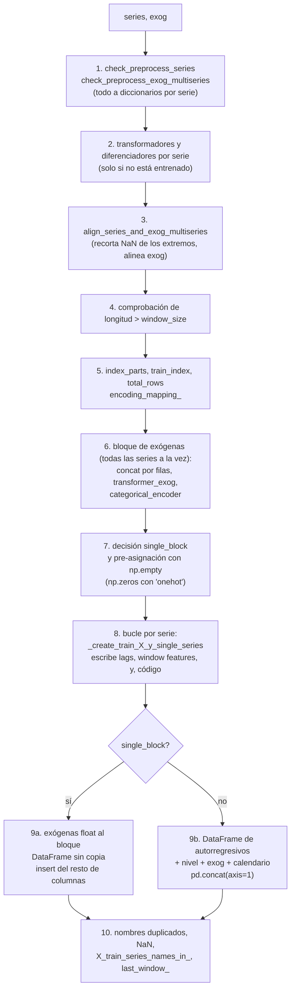

# Creación de las matrices de entrenamiento en `ForecasterRecursiveMultiSeries`

Describe cómo se construyen `X_train` e `y_train` en
`skforecast/recursive/_forecaster_recursive_multiseries.py`, tal como queda el código tras el
cambio de bloque único y el paso de `'onehot'` al bloque (2026-10-03, rama
`refactor/optimize_multiseries_fit`). El código se cita por nombre de método, no por número
de línea.

Alcance: solo `ForecasterRecursiveMultiSeries`. El resto de forecasters tienen su propio
`_create_train_X_y`.

## 1. Qué se construye

Una única matriz para todas las series, apiladas por filas:

- `X_train`: `pandas.DataFrame` con una fila por observación entrenable de cada serie.
- `y_train`: `pandas.Series` de nombre `'y'` con el valor objetivo de cada fila.

Las columnas de `X_train` van siempre en este orden:

| Orden | Grupo | Columnas | Origen |
|---|---|---|---|
| 1 | Lags | `lag_1`, `lag_2`, ... | `_create_lags` |
| 2 | Window features | nombres de cada `window_features` | `_create_window_features` |
| 3 | Serie (nivel) | `_level_skforecast`, o una columna por serie con `'onehot'` | `encoding_mapping_` |
| 4 | Exógenas | columnas de `exog` tras `transformer_exog` | bloque de exógenas |
| 5 | Calendario | `calendar_features.feature_names_out_` | `calendar_features` |

Ejemplo con dos series de distinta longitud, `lags=2`,
`RollingFeatures(stats='mean', window_sizes=3)`, `encoding='ordinal'` y dos exógenas (una
float y una int). El diccionario de series se pasa en el orden `s_b`, `s_a`:

```text
            lag_1  lag_2  roll_mean_3  _level_skforecast  temp  holiday |     y
date
2024-01-04   12.0   11.0         11.0                1.0  23.0        0 |  13.0   <- s_b
2024-01-05   13.0   12.0         12.0                1.0  24.0        0 |  14.0
2024-01-06   14.0   13.0         13.0                1.0  25.0        0 |  15.0
2024-01-07   15.0   14.0         14.0                1.0  26.0        1 |  16.0
2024-01-04  102.0  101.0        101.0                0.0  33.0        0 | 103.0   <- s_a
2024-01-05  103.0  102.0        102.0                0.0  34.0        0 | 104.0
```

De este ejemplo salen tres propiedades que el resto del código da por hechas:

- **Las filas de cada serie son contiguas y van en el orden de `series`**, no en orden
  alfabético. `s_b` va primero porque es la primera clave del diccionario.
- **El código de cada serie sí es alfabético**: `encoding_mapping_ = {'s_a': 0, 's_b': 1}`.
- **El índice es la concatenación de los índices de cada serie**, así que tiene fechas
  repetidas. Cada serie pierde sus primeras `window_size` observaciones.

## 2. Quién llama a `_create_train_X_y`

| Llamador | `is_fitted` | Uso |
|---|---|---|
| `fit` | `False` | entrena el estimador y calcula los residuos in-sample |
| `create_train_X_y` (público) | el del forecaster | devuelve `X_train, y_train`; con `encoding=None` quita `_level_skforecast` |
| `_train_test_split_one_step_ahead` | `False` para train, `True` para test | búsquedas y backtesting con `OneStepAheadFold` |
| `set_in_sample_residuals` | `True` | recalcula los residuos de un forecaster ya entrenado |
| `select_features_multiseries` | `False`, sobre una copia | matriz para el selector, sin las columnas de la serie |

Con `is_fitted=True` el método no ajusta nada: reutiliza los transformadores, el
`categorical_encoder` y el `encoding_mapping_` del entrenamiento (sección 9). El
`create_train_X_y` público no cambia `is_fitted`, así que con un forecaster ya entrenado se
comporta como en esa sección.

`_create_train_X_y` devuelve una tupla de 13 elementos: las dos matrices más los metadatos
que `fit` guarda como atributos (`series_names_in_`, `X_train_series_names_in_`,
`exog_names_in_`, `categorical_features_names_in_`, nombres de window features, de
calendario y de exógenas, `exog_dtypes_in_`, `exog_dtypes_out_`, `last_window_`).

## 3. Flujo de `_create_train_X_y`



1. **Entrada a diccionarios.**
   - `check_preprocess_series` convierte `series` (DataFrame ancho, DataFrame largo con
     MultiIndex o diccionario) en `series_dict = {nombre: pd.Series}` y devuelve el índice de
     cada serie en `series_indexes`.
   - `check_preprocess_exog_multiseries` hace lo mismo con `exog`:
     `exog_dict = {nombre: pd.DataFrame | None}`.
   - `calendar_features` exige que el índice sea `DatetimeIndex`.
2. **Transformadores.** Si el forecaster no está entrenado, `initialize_transformer_series`
   crea un transformador por serie más el de `'_unknown_level'`, e
   `initialize_differentiator_multiseries` un diferenciador por serie.
3. **Alineado.** `align_series_and_exog_multiseries`:
   - recorta los NaN iniciales y finales de cada serie (los interiores se quedan);
   - recorta la exógena de cada serie al mismo rango y, si le faltan fechas, la reindexa con
     NaN;
   - si la exógena queda vacía, la deja en `None`.

   Después se ajusta el transformador de `'_unknown_level'` con todas las series
   concatenadas.
4. **Longitud.** Cada serie debe tener más de `window_size` observaciones. Se comprueba aquí,
   antes de cualquier trabajo con exógenas, para que el error sea el de skforecast y no uno
   de sklearn al ajustar un encoder con 0 filas.
5. **Índice y codificación.**
   - `index_parts` es el índice de cada serie sin sus primeras `window_size` posiciones;
     `train_index` es su concatenación y `total_rows` su longitud. Todo lo que sigue se
     dimensiona con `total_rows`.
   - `encoding_mapping_ = {nombre: código}` con los nombres ordenados alfabéticamente. Se
     reconstruye en cada entrenamiento, para no arrastrar series de un `fit` anterior.
6. **Exógenas** (sección 5).
7. **Decisión de ensamblado y pre-asignación** (sección 7).
8. **Bucle por serie** (sección 4). Cada serie escribe en su tramo de filas
   `[offset, offset + n)` del array pre-asignado.
9. **Ensamblado** del DataFrame (sección 7).
10. **Cierre** (secciones 8 y 9): nombres duplicados, NaN, series presentes y última ventana.

## 4. Parte autorregresiva: `_create_train_X_y_single_series`

Recibe una serie y devuelve arrays de numpy: la matriz de lags y window features, el nombre
de la serie, los nombres de las window features y `y_train`.

1. **Transformación.** `transform_numpy` aplica el transformador de la serie. Con
   `encoding=None` se usa el de `'_unknown_level'`, ya ajustado con todas las series, así que
   aquí nunca se ajusta. Con el resto de codificaciones se ajusta si el forecaster no está
   entrenado.
2. **Diferenciación.** Si la serie tiene diferenciador, `fit_transform`. Con el forecaster ya
   entrenado se usa una copia, para no alterar el estado guardado.
3. **Lags** (`_create_lags`).
   - `sliding_window_view(y, window_size)[:-1]` da una vista con una ventana por fila.
   - Con lags contiguos (`lags_are_contiguous`, por ejemplo `lags=24`) se toma un corte
     básico invertido, que sigue siendo una vista sin copia: `lag_1` queda en la primera
     columna.
   - Con lags no contiguos (por ejemplo `[1, 7, 14]`) hace falta indexado avanzado, que
     copia.
   - `y_train = y[window_size:]`.
4. **Window features** (`_create_window_features`).
   - Se llama a `transform_batch` de cada elemento de `window_features` con la serie ya
     transformada. Con diferenciación se quitan antes las primeras `differentiation_max`
     posiciones, que la diferenciación deja en NaN.
   - Del resultado se toman las últimas `len(train_index)` filas.
   - Se comprueba que `transform_batch` devuelve un DataFrame, con ese número de filas y con
     el mismo índice que `train_index`. Estas comprobaciones protegen frente a clases de
     usuario.
5. **Unión.** Si hay lags y window features, `np.concatenate(axis=1)`; si solo hay una
   pieza, se devuelve tal cual.

`window_size` es el máximo entre `max_lag` y el mayor tamaño de ventana de las window
features, más `differentiation_max` si hay diferenciación.

## 5. Exógenas

Las exógenas de todas las series se procesan a la vez, antes del bucle por serie:

1. **Buffer por serie.** Para cada serie, `exog_dict[k].iloc[window_size:]`. Si la serie no
   tiene exógenas, una `Series` de NaN con el índice de la serie y el nombre
   `'_dummy_exog_col_to_keep_shape'`, para que la concatenación conserve sus filas.
2. **Concatenación por filas:** `pd.concat(axis=0, copy=False)`.
   - Si el resultado es una `Series`, ninguna serie tenía exógenas: se emite
     `MissingExogWarning` y se entrena sin ellas.
   - Si no, se elimina la columna dummy. Las series sin una exógena quedan con NaN en ella.
3. **Metadatos de entrada:** `exog_names_in_` y `exog_dtypes_in_`.
4. **`transformer_exog`:** `transform_dataframe`, con ajuste si el forecaster no está
   entrenado. El índice resultante debe ser igual a `train_index`; si no, `ValueError`.
5. **Categóricas** (`categorical_features`):
   - `'auto'`: son categóricas las columnas que no son numéricas ni booleanas.
   - lista: las columnas indicadas, que deben existir tras `transformer_exog`.
   - Se codifican con `categorical_encoder`, un `OrdinalEncoder` con salida `float` y NaN
     para valores desconocidos o ausentes. Después de este paso son columnas `float64`.
   - `None`: no se codifica nada y `check_exog_dtypes` valida los tipos.
6. **Metadatos de salida:** `X_train_exog_names_out_` y `exog_dtypes_out_`.

El resultado, `X_train_exog`, es un DataFrame con el mismo índice que `train_index`.

## 6. Codificación de la serie

`encoded_values` guarda el código (`encoding_mapping_`) de la serie de cada fila y se rellena
en el bucle. Qué columna produce depende de `encoding`:

| `encoding` | Columna en `X_train` | dtype | Llega al estimador |
|---|---|---|---|
| `'ordinal'` | `_level_skforecast` | `float64` | sí |
| `'ordinal_category'` | `_level_skforecast` | `category` (categorías enteras) | sí, como categórica |
| `'onehot'` | una columna por serie, con su nombre, en orden alfabético | `float64` | sí |
| `None` | `_level_skforecast` | `float64` | no: se elimina antes de entrenar |

- Con `encoding=None` la columna existe en la matriz interna, porque los residuos y los pesos
  necesitan saber a qué serie pertenece cada fila. `fit`, `create_train_X_y` y
  `set_in_sample_residuals` la eliminan antes de pasar la matriz al estimador o al usuario.
- Con `'onehot'` hay una columna por serie de `encoding_mapping_`, también para las series
  que pierden todas sus filas, y el valor del mapping es la posición de la columna. Las
  matrices de predicción (`_encode_levels_onehot`) usan las mismas columnas en el mismo
  orden; una serie sin filas en el entrenamiento, o desconocida, se codifica con ceros. Hasta
  la 0.25.0 la predicción colocaba el 1 según el orden de entrada de las series, y predecía
  mal si no llegaban en orden alfabético; además, si una serie perdía todas sus filas, la
  matriz de predicción tenía menos columnas que la de entrenamiento y `predict` fallaba.

## 7. Ensamblado de `X_train`

Hay dos caminos, elegidos con el flag `single_block`.

### 7.1 Bloque único

Todas las columnas `float64` se escriben en un solo array pre-asignado:

```python
allocate = np.zeros if self.encoding == 'onehot' else np.empty
X_train = allocate((total_rows, n_block_cols), order='F', dtype=float)
```

- **Qué entra en el bloque:** lags, window features, el nivel (con `'ordinal'`, `'onehot'`
  y `None`) y las exógenas cuyo dtype es exactamente `float64`. Las categóricas codificadas
  entran, porque el encoder las deja en `float64`.
- **Con `'onehot'`** el bloque nace a ceros, así que tras el bucle basta una sola escritura
  para poner los unos de las columnas de serie
  (`X_train[np.arange(total_rows), n_autoreg_cols + encoded_values] = 1.`).
- **Orden `'F'`:** las columnas son contiguas en memoria, que es el layout de un bloque de
  pandas. `pd.DataFrame(data=X_train, copy=False)` envuelve el array sin copiarlo.
- **Escritura:**
  - el bucle escribe los autorregresivos en `X_train[offset:offset + n, :n_autoreg_cols]`;
  - con `'ordinal'` y `None`, el nivel se escribe a través de `encoded_values`, que es una
    vista de la columna `n_autoreg_cols` del bloque;
  - tras el bucle, cada exógena float se copia a su columna.
- **Columnas fuera del bloque:** se añaden con `DataFrame.insert`, en posición ascendente
  para que cada una caiga en su sitio definitivo:
  - el nivel categórico de `'ordinal_category'`;
  - las exógenas de cualquier otro dtype (`int`, `bool`, `category`, `float32`, tipos de
    extensión), insertadas como `Series` para conservar su dtype. Se insertan con
    `allow_duplicates=True` porque los nombres duplicados se comprueban después, con el
    mensaje de skforecast.

Qué se gana: el camino anterior creaba varios bloques float (autorregresivos, nivel,
exógenas) y `pd.concat` o el propio estimador los copiaban enteros para unirlos. Con el
bloque único esa copia desaparece.

### 7.2 Camino con `pd.concat`

Es el ensamblado anterior:

1. array de autorregresivos en orden `'C'`, envuelto en un DataFrame;
2. el nivel: columna `_level_skforecast` asignada al DataFrame, o un DataFrame aparte con las
   columnas `'onehot'` (`np.eye(n_series, dtype=float)[encoded_values]`, float como en el
   bloque único);
3. `X_train_exog`, si hay exógenas;
4. las variables de calendario: se calculan una vez por fecha única
   (`calendar_features.fit_transform(train_index.unique())`) y se expanden con
   `reindex(train_index)`;
5. `pd.concat(axis=1, copy=False)` de las piezas y reasignación de `train_index` como índice.

### 7.3 Cuándo se usa cada uno

El bloque único se usa salvo en estos casos:

| Caso | Motivo |
|---|---|
| `calendar_features` no es `None` | las variables de calendario se calculan aparte y se expanden con `reindex` |
| se insertarían más columnas que las que tiene el bloque | `insert` copia cada columna insertada (`pd.concat` no las copiaba), así que el bloque solo gana cuando son pocas |
| se insertarían 100 columnas o más | pandas emite `PerformanceWarning` por DataFrame fragmentado con más de 100 bloques |
| `encoding=None` sin exógenas | ver abajo |

Con `encoding=None` y sin exógenas se mantiene el camino anterior porque el nivel se elimina
antes de entrenar. En ese camino, el estimador recibe los autorregresivos como un array
contiguo por filas; con el bloque único lo recibiría contiguo por columnas. Los valores son
los mismos, pero algunos estimadores (`LinearRegression`) dan resultados que difieren en los
últimos bits según el layout, y el cambio debía dejar los resultados idénticos.

Regla de las columnas insertadas, medida con 500 series de 2,000 observaciones y exógenas
`int` (tiempo nuevo / anterior de `_create_train_X_y`, antes de añadir la regla):

| Exógenas `int` | 3 lags (bloque de 4 columnas) | 24 lags (bloque de 25 columnas) |
|---|---|---|
| 5 | 0.94 | 0.53 |
| 15 | 1.10 | 0.65 |
| 30 | 1.20 | 0.71 |
| 60 | 1.29 | 0.94 |
| 99 | 1.39 | 1.03 |

El punto de equilibrio está entre 2 y 3.5 columnas insertadas por columna del bloque. La
regla `n_inserted_cols <= n_block_cols` queda del lado seguro.

### 7.4 Layout resultante

| Configuración | Camino | Qué recibe el estimador |
|---|---|---|
| `'ordinal'`, sin exógenas o con exógenas float | bloque único | un bloque float de columnas contiguas; la conversión a numpy no copia |
| `None` con exógenas float | bloque único | lo mismo, tras eliminar la columna del nivel |
| `None` sin exógenas | `pd.concat` | array contiguo por filas, como antes del cambio |
| `'onehot'`, sin exógenas o con exógenas float | bloque único | un bloque float de columnas contiguas, con una columna por serie |
| `'ordinal_category'` | bloque único | bloque float más el nivel categórico |
| exógenas no float, pocas | bloque único | bloque float más un bloque por columna insertada |
| `calendar_features` | `pd.concat` | como antes del cambio |

Restricción que no se debe romper: el bloque nunca se construye en orden `'C'`. Con filas
contiguas, leer una columna (por ejemplo `_level_skforecast`) recorre la memoria a saltos y
las etapas posteriores se vuelven mucho más lentas.

### 7.5 Efecto medido

500 series de 2,000 observaciones, 24 lags, 4 window features, `encoding='ordinal'`,
LightGBM de 25 árboles. Tiempo nuevo / anterior (mediana de 7) y pico de memoria de
`create_train_X_y`:

| Escenario | `_create_train_X_y` | `fit()` | Pico de memoria |
|---|---|---|---|
| A: sin exógenas | 0.91 | 0.85 | 286 a 260 MB |
| B: 10 exógenas float | 0.71 | 0.91 | 954 a 500 MB |
| C: 5 float y 5 categóricas | 0.82 | 0.94 | 925 a 471 MB |

Con `encoding='onehot'`, series de 2,000 observaciones y la misma configuración (tiempos
anterior y nuevo, mediana de 7; 3 en el `fit()` de 300 series):

| Series | Exógenas | `_create_train_X_y` | `fit()` | Pico de memoria |
|---|---|---|---|---|
| 100 | no | 0.27 a 0.15 s | 1.52 a 1.07 s | 242 a 220 MB |
| 100 | 10 float | 0.35 a 0.18 s | 1.66 a 1.25 s | 336 a 269 MB |
| 300 | no | 3.02 a 0.79 s | 9.14 a 3.39 s | 1,854 a 1,675 MB |
| 300 | 10 float | 3.26 a 0.89 s | 9.37 a 3.85 s | 2,008 a 1,823 MB |

Las matrices son iguales salvo el dtype de las columnas de serie (`int64` antes, `float64`
ahora), y las predicciones, los residuos y los intervalos son idénticos.

## 8. Cierre: nombres, NaN y series presentes

1. **`y_train`:** `pd.Series(data=y_train, index=train_index, name='y', copy=False)`.
2. **Nombres duplicados:** si dos columnas de `X_train` comparten nombre, `ValueError`
   ("Duplicated feature names detected in X_train").
3. **NaN en `y_train`** (NaN interiores de las series): se eliminan esas filas de `X_train`
   e `y_train`, con `MissingValuesWarning`. El objetivo no puede tener NaN.
4. **NaN en `X_train`:**
   - con `dropna_from_series=True`, se eliminan las filas con algún NaN, con aviso;
   - con `False` (por defecto), se conservan y solo se avisa: hay estimadores que admiten
     NaN.
5. **Matriz vacía:** si no queda ninguna fila, `ValueError`.
6. **`X_train_series_names_in_`:** las series que conservan alguna fila. Con `'onehot'`,
   las columnas de serie cuya suma es mayor que 0; con el resto, los códigos presentes en
   `_level_skforecast`. Puede ser menor que `series_names_in_` si una serie pierde todas sus
   filas por NaN. El orden no es el mismo en los dos casos: con `'onehot'` sigue el de
   `series`; con el resto, el alfabético de `encoding_mapping_`.
7. **`last_window_`:** si `store_last_window` no es `False`, las últimas `window_size`
   observaciones de cada serie (sin transformar), que `predict` usa para calcular los
   primeros lags.

El filtrado de filas con NaN conserva el orden, así que las filas de cada serie siguen siendo
contiguas.

## 9. Diferencias con el forecaster ya entrenado

Con `is_fitted=True` (`set_in_sample_residuals` y el conjunto de test de
`_train_test_split_one_step_ahead`):

- `series` solo puede contener series vistas en el entrenamiento; `exog` debe tener las
  mismas variables, o ser `None` si se entrenó sin ellas.
- No se crean ni ajustan transformadores: `transformer_series_`, `transformer_exog` y
  `categorical_encoder` solo transforman.
- La diferenciación usa una copia del diferenciador de cada serie.
- `encoding_mapping_` no se reconstruye.

## 10. Invariantes que usa el resto del código

- **Filas contiguas por serie.** `_get_level_row_slices` lee una vez la codificación y
  devuelve `{serie: slice}`. Lo usan `fit` y `set_in_sample_residuals` para repartir los
  residuos por serie, y `create_sample_weights` para los pesos. Si las filas de una serie no
  son contiguas, lanza `ValueError`.
- **`_level_skforecast` siempre existe en la matriz interna** (salvo con `'onehot'`, donde
  la información está en las columnas de serie).
- **El índice de `X_train` y de `y_train` es `train_index`**, con el nombre del índice de
  `series` en los dos caminos de ensamblado. Antes del cambio, `pd.concat` perdía el nombre
  cuando el índice de `exog` tenía otro nombre o ninguno.
- **El orden de las columnas** es el de la sección 1. `fit` lo guarda en
  `X_train_features_names_out_` y `predict` construye sus matrices con el mismo orden.

## 11. Casos límite conocidos

- **Estimadores que modifican `X` en el sitio** (por ejemplo
  `LinearRegression(copy_X=False)`). Con el bloque único, la conversión a numpy no copia: el
  estimador escribe sobre el propio `X_train`, incluidas las columnas de la serie, y la etapa
  de residuos trabaja después con la matriz alterada. Medido contra la 0.25.0 instalada
  (residuos in-sample con `copy_X=False` frente a `copy_X=True`):

  | Configuración | 0.25.0 | Ahora |
  |---|---|---|
  | `'ordinal'` u `'onehot'`, varias series | correcto (`'ordinal'` con exógenas: `ValueError: Input data X cannot be empty`) | `KeyError` en la etapa de residuos |
  | `'ordinal'` u `'onehot'`, una serie | correcto (`'ordinal'` con exógenas: residuos erróneos) | residuos erróneos, sin error |
  | `None` | residuos erróneos, sin error | igual |

  Cuando `fit` termina, las predicciones son correctas: el estimador se ajusta bien, y lo
  erróneo son los residuos in-sample y, con ellos, los intervalos. El problema es anterior
  a la rama (`None`, y `'ordinal'` con exógenas); la rama lo extiende a `'ordinal'` sin
  exógenas y a `'onehot'`, donde antes las columnas enteras forzaban una copia. Sin cambio
  de código en esta rama: arreglarlo exige copiar la matriz para estos estimadores, lo que
  deshace la ganancia, o que la etapa de residuos no dependa de que el estimador deje
  `X_train` intacto. Ninguna guía ni skill usa estos estimadores.
- **Una exógena float llamada `_level_skforecast` con `'ordinal_category'`:** el `insert`
  del nivel lanza el error de pandas ("cannot insert _level_skforecast, already exists") en
  lugar del mensaje de nombres duplicados de skforecast. Se mantiene así por decisión.
- **Una window feature llamada `_level_skforecast`:** antes la columna del nivel la
  sobrescribía en silencio; con el bloque único se lanza un error.

## 12. Tests y comprobaciones

- `skforecast/recursive/tests/tests_forecaster_recursive_multiseries/test_create_train_X_y.py`:
  valores, dtypes y orden de columnas de las matrices, los dos caminos de ensamblado, el
  layout en memoria (con API pública: `np.shares_memory`, `strides`, `ctypes.data`) y el
  nombre del índice.
- `test_create_train_X_y_single_series.py`: la parte autorregresiva por serie.
- `test_get_level_row_slices.py`: los tramos de filas por serie.
- `test_predict.py`, `test_predict_bootstrapping.py` y `test_create_predict_X.py`: columnas
  `'onehot'` de la matriz de predicción con series en orden no alfabético, con una serie sin
  filas en el entrenamiento y con un nivel desconocido.
- `test_train_test_split_one_step_ahead.py`: matrices de `OneStepAheadFold`.
- `skforecast/feature_selection/tests/tests_feature_selection/test_select_features_multiseries.py`:
  la columna `'onehot'` de una serie sin filas no llega al selector.
- `dev/profiling_multiseries_fit/11_snapshot_outputs.py --check`: huellas de 19
  configuraciones, para comprobar que un cambio deja los resultados idénticos.
