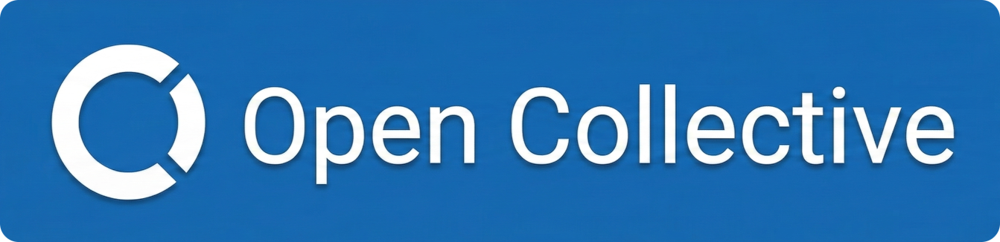

# Funding and Donations

**skforecast** is a critical piece of open-source digital infrastructure. To ensure its long-term stability, continuous maintenance, and the development of new features, the project is supported through professional service agreements and investments.

## Institutional Investment

### The Sovereign Tech Fund

**skforecast has been awarded a service agreement by the Sovereign Tech Fund**, a program of the Sovereign Tech Agency, which invests globally in maintaining digital infrastructure via public procurement.

Starting in June 2026, this 12-month investment allows the core maintainers to dedicate substantial time and resources to the project, ensuring that the library remains robust, secure, and ready for enterprise-level adoption.

We are incredibly grateful for their support in keeping open-source software sustainable. You can learn more about their mission by visiting the [Sovereign Tech Agency](https://sovereign.tech) website, the organization that runs the Sovereign Tech Fund.

---

## Donations

If you found **skforecast** useful, you can support us with a donation. Your contribution will help us **continue developing, maintaining, and improving** this project. Every contribution, no matter the size, makes a difference. **Thank you for your support!**

💙 Open Collective

☕ Buy us a coffee

❤️ Become a GitHub Sponsor

💳 Donate via PayPal
 

---

## 🤝 Sponsor for Companies

  

If you’d like to sponsor **skforecast** in a unique way or explore potential partnerships, let’s talk!

  

    

      
    

    

      <strong>Joaquín Amat Rodrigo</strong>
      
j.amatrodrigo@gmail.com

      <a href="https://www.linkedin.com/in/joaquin-amat-rodrigo" class="linkedin-link" target="_blank" rel="noopener noreferrer">LinkedIn</a>
    

  

  

    

      
    

    

      <strong>Javier Escobar Ortiz</strong>
      
javier.escobar.ortiz@gmail.com

      <a href="https://www.linkedin.com/in/javier-escobar-ortiz" class="linkedin-link" target="_blank" rel="noopener noreferrer">LinkedIn</a>
    

  

