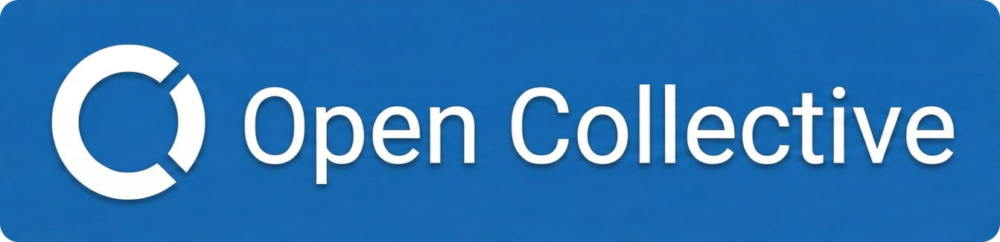
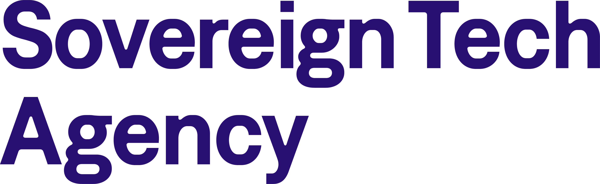

# Sponsorship and Funding

 

**skforecast** is free, BSD-3 licensed software, widely used in industry and research. It is developed and maintained by a small core team, and it is a [NumFOCUS](https://numfocus.org/sponsored-projects/affiliated-projects) and [GC.OS](https://gc-os-ai.github.io/) affiliated project.

Keeping a library like this reliable takes sustained, paid work: compatibility with every new release of Python, pandas, and scikit-learn, security and bug fixes, documentation, and answering users. This page explains how organizations can fund that work and what they get in return.

## Why fund skforecast

- **Reduce your dependency risk.** If your forecasts depend on skforecast, funding its maintenance is the most direct way to make sure it stays compatible, tested, and supported.
- **Have a voice.** Sponsors and partners have a direct line to the core developers and can give input on the roadmap.
- **Be visible.** Your logo is shown to the data scientists and machine learning engineers who read the repository and the documentation.
- **Everything stays open.** All funded work is released under the same BSD-3 license, for everyone.

## Corporate sponsorship

Sponsorship is recurring funding for the general maintenance and development of the project.

| | Bronze | Silver | Gold | Partner |
|:--|:--:|:--:|:--:|:--:|
| Indicative amount | 100 USD per month (1,200 USD per year) | 250 USD per month (3,000 USD per year) | 500 USD per month (6,000 USD per year) | from 15,000 USD per year, by agreement |
| Name and link on this page | ✔️ | ✔️ | ✔️ | ✔️ |
| Acknowledgement in release notes | ✔️ | ✔️ | ✔️ | ✔️ |
| Logo on this page | | ✔️ | ✔️ | ✔️ |
| Logo on the GitHub README and the documentation home page | | | ✔️ | ✔️ (top position) |
| Priority triage of your issues and bug reports | | | ✔️ | ✔️ |
| Roadmap call with the core developers | | | once a year | twice a year |
| Announcement on the skforecast LinkedIn page | | | ✔️ | ✔️ |
| Custom terms, direct invoice | | | | ✔️ |

Bronze, Silver, and Gold sponsorships are managed through [Open Collective](https://opencollective.com/skforecast), which accepts card payments and bank transfers, provides a receipt for every payment, and publishes a transparent ledger of how the money is used. Partner sponsorships are agreed and invoiced directly. Priority triage means your reports are looked at first; it is not a support contract (see below).

### Current sponsors

*Your organization could be the first one listed here.*

## Partnerships and services

For needs that go beyond sponsorship, the core development team works directly with companies. These engagements are scoped, agreed in writing, and invoiced.

- **Feature sponsorship.** Fund a specific feature, forecaster, or integration that your team needs. The work is planned with you, reviewed to the same standard as the rest of the library, released as open source, and acknowledged in the release notes.
- **Support agreement.** A private channel with the core developers, agreed response times on business days, help with upgrades and migrations, and review of your forecasting pipelines.
- **Training and workshops.** Hands-on sessions on forecasting with skforecast, remote or on site, adapted to your data and use cases.
- **Consulting.** See [Consulting & Professional services](./consulting.md).

## Institutional funding

### The Sovereign Tech Fund

skforecast has been awarded a [service agreement by the Sovereign Tech Fund](https://www.sovereign.tech/tech/skforecast), a program of the [Sovereign Tech Agency](https://sovereign.tech), which invests globally in maintaining open digital infrastructure via public procurement.

Starting in June 2026, this 12-month investment allows the core maintainers to dedicate substantial time to the project, so that the library remains robust, secure, and ready for enterprise-level adoption. We are very grateful for their support.

We welcome conversations with other public funders, foundations, and research programs interested in open-source forecasting infrastructure.

## Individual support

If skforecast has been useful to you personally, you can support it through any of these channels:

- [Open Collective](https://opencollective.com/skforecast)
- GitHub Sponsors: [Joaquín Amat Rodrigo](https://github.com/sponsors/JoaquinAmatRodrigo) and [Javier Escobar Ortiz](https://github.com/sponsors/JavierEscobarOrtiz)
- [Buy Me a Coffee](https://www.buymeacoffee.com/skforecast)
- [PayPal](https://www.paypal.com/donate/?hosted_button_id=D2JZSWRLTZDL6)

Citing the project, starring the repository, and sharing your work with skforecast help just as much.

## Get in touch

  

To discuss sponsorship, a partnership, or a service engagement, contact the core developers.

  

    

      
    

    

      <strong>Joaquín Amat Rodrigo</strong>
      
j.amatrodrigo@gmail.com

      <a href="https://www.linkedin.com/in/joaquin-amat-rodrigo" class="linkedin-link" target="_blank" rel="noopener noreferrer">LinkedIn</a>
    

  

  

    

      
    

    

      <strong>Javier Escobar Ortiz</strong>
      
javier.escobar.ortiz@gmail.com

      <a href="https://www.linkedin.com/in/javier-escobar-ortiz" class="linkedin-link" target="_blank" rel="noopener noreferrer">LinkedIn</a>
    

  

