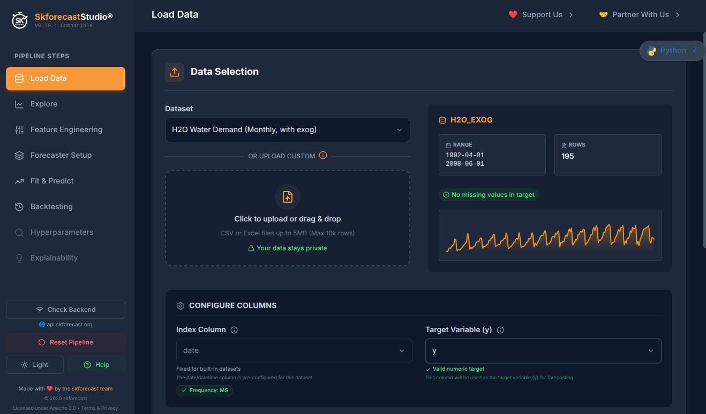

# Skforecast Studio

**[Skforecast Studio](https://studio.skforecast.org/)** is an interactive, no-code application to build time series forecasting models visually, while automatically generating production-ready Python code using [skforecast](https://skforecast.org/).

Whether you're exploring data, prototyping models, or generating deployment-ready code, Skforecast Studio helps you go from raw time series to forecasting pipeline in minutes, no coding required.

  

## Key Features

- :chart_with_upwards_trend: **Visual model building** — Configure forecasters, lags, transformers, and exogenous variables through an intuitive interface.
- :snake: **Auto-generated Python code** — Every step produces clean, reproducible skforecast code ready for production.
- :mag: **Interactive data exploration** — Visualize your time series, inspect seasonality, and detect patterns before modeling.
- :bar_chart: **Backtesting and evaluation** — Evaluate model performance with built-in backtesting and metrics.
- :rocket: **No installation needed** — Runs directly in your browser at [studio.skforecast.org](https://studio.skforecast.org/).

## Who is it for?

- **Data scientists** who want to prototype forecasting models faster.
- **Analysts and domain experts** who need forecasting capabilities without writing code.
- **Teams** looking for a collaborative way to explore and validate time series models.
- **Students and educators** learning time series forecasting with a hands-on tool.

## Try it now

:point_right: **[Launch Skforecast Studio](https://studio.skforecast.org/)**

## Feedback and Issues

Skforecast Studio is developed by the skforecast team. If you encounter any issues or have suggestions, please open an issue using the [Skforecast Studio issue template](https://github.com/skforecast/skforecast/issues/new?template=skforecast_studio.yml).
